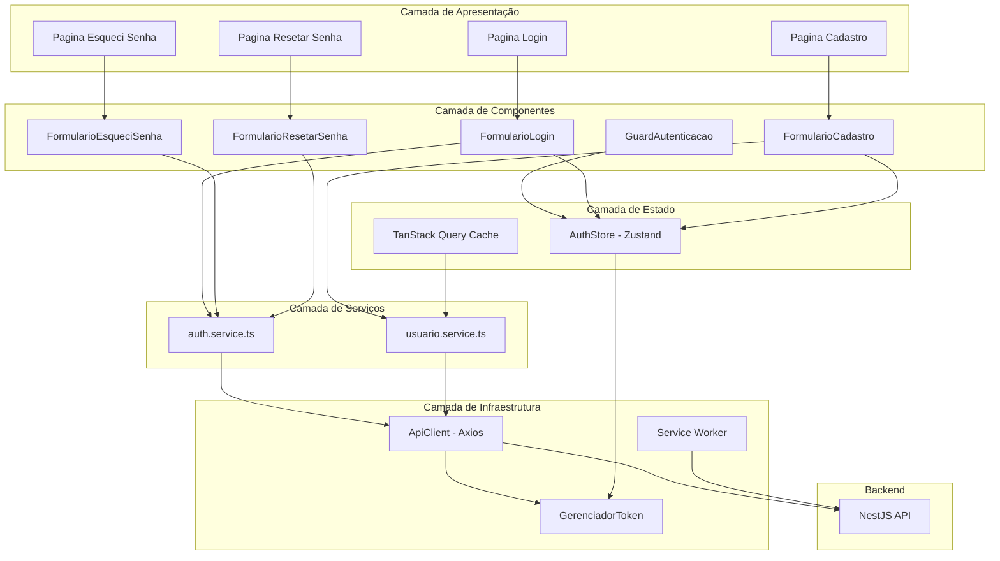
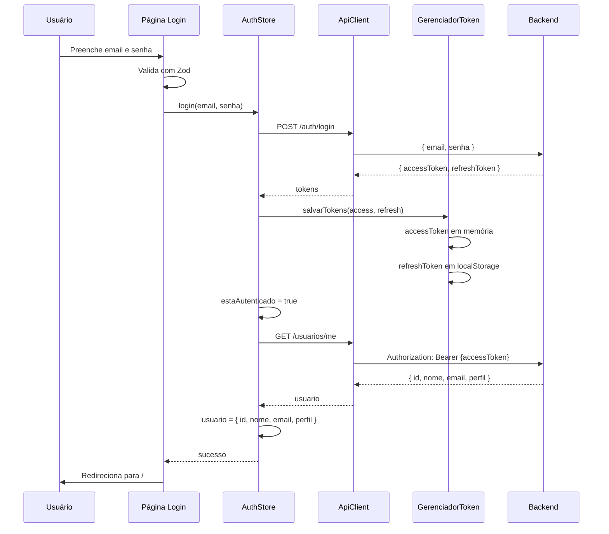
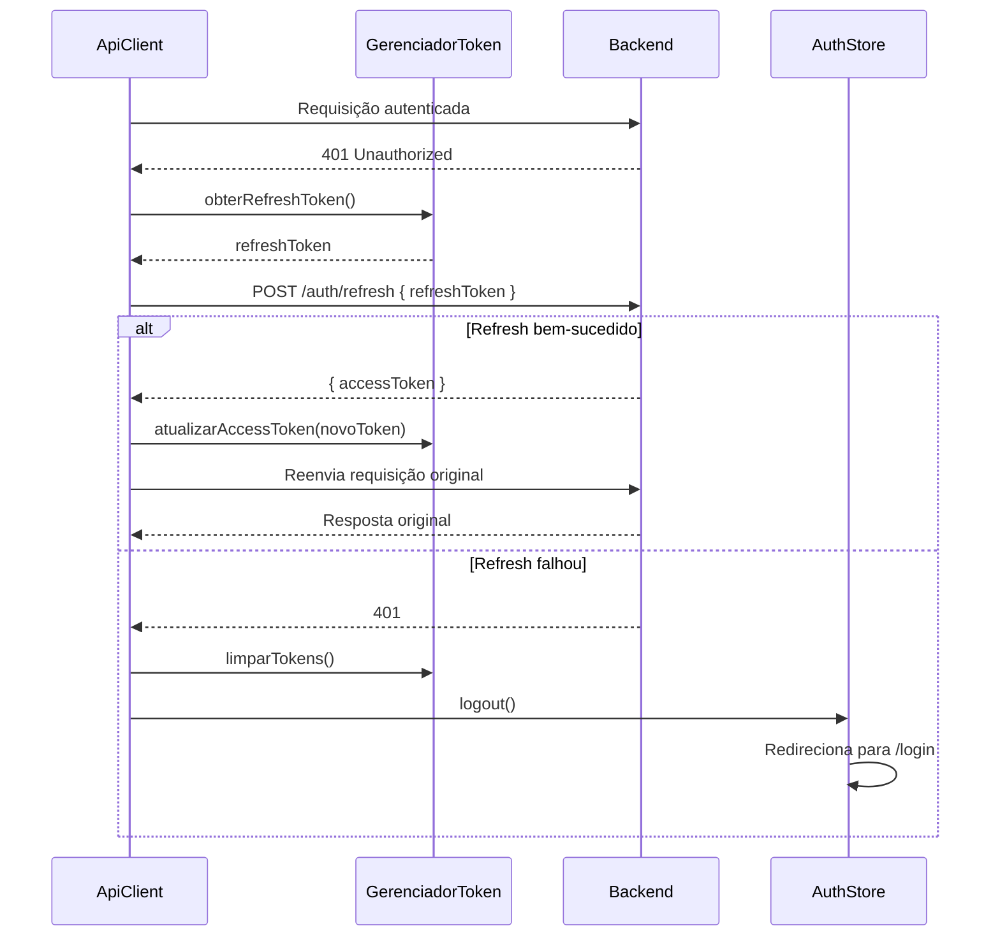

# Design Document — Bolão Frontend Login

## Overview

Este documento descreve o design técnico do módulo de autenticação do frontend PWA do Bolão. A aplicação será construída com Next.js 15 (App Router), utilizando uma arquitetura modular e escalável que suporta crescimento futuro (grupos, palpites, ranking).

O módulo cobre:
- Scaffolding do projeto com todas as ferramentas configuradas
- Cliente HTTP centralizado com renovação automática de tokens
- Store de autenticação com Zustand
- Proteção de rotas (middleware + componente)
- Páginas: Login, Cadastro, Esqueci Senha, Resetar Senha
- Configuração PWA (manifest, service worker)
- Design responsivo mobile-first com tema esportivo

### Decisões Técnicas

| Decisão | Escolha | Justificativa |
|---------|---------|---------------|
| Framework | Next.js 15 App Router | SSR/SSG, file-based routing, middleware nativo |
| Estilização | Tailwind CSS + shadcn/ui | Utility-first, componentes acessíveis prontos |
| Estado Auth | Zustand | Leve, sem boilerplate, persistência simples |
| Formulários | React Hook Form + Zod | Performance (uncontrolled), validação type-safe |
| Data Fetching | TanStack Query | Cache, retry, invalidation automática |
| HTTP Client | Axios | Interceptors para token refresh |
| PWA | next-pwa (Workbox) | Integração nativa com Next.js |
| Idioma código | Português (pt-BR) | Consistência com backend existente |

## Architecture

### Estrutura de Pastas

```
bolao-frontend/
├── public/
│   ├── manifest.json
│   ├── sw.js                    # Service Worker (gerado pelo next-pwa)
│   └── icons/
│       ├── icon-192x192.png
│       └── icon-512x512.png
├── src/
│   ├── app/
│   │   ├── layout.tsx           # Root layout (providers, metadata)
│   │   ├── page.tsx             # Página inicial (protegida)
│   │   ├── (auth)/              # Route group para páginas de auth
│   │   │   ├── layout.tsx       # Layout compartilhado auth (centralizado)
│   │   │   ├── login/
│   │   │   │   └── page.tsx
│   │   │   ├── cadastro/
│   │   │   │   └── page.tsx
│   │   │   ├── esqueci-senha/
│   │   │   │   └── page.tsx
│   │   │   └── resetar-senha/
│   │   │       └── page.tsx
│   │   └── (protegido)/         # Route group para rotas autenticadas
│   │       ├── layout.tsx       # Layout com guard de autenticação
│   │       └── ...
│   ├── components/
│   │   ├── ui/                  # Primitivos shadcn/ui
│   │   ├── auth/                # Componentes específicos de auth
│   │   │   ├── formulario-login.tsx
│   │   │   ├── formulario-cadastro.tsx
│   │   │   ├── formulario-esqueci-senha.tsx
│   │   │   ├── formulario-resetar-senha.tsx
│   │   │   └── guard-autenticacao.tsx
│   │   └── layout/              # Componentes de layout
│   │       ├── indicador-offline.tsx
│   │       └── logo-bolao.tsx
│   ├── hooks/
│   │   ├── use-auth.ts          # Hook de conveniência para auth store
│   │   └── use-usuario.ts       # Hook TanStack Query para /usuarios/me
│   ├── lib/
│   │   ├── api-client.ts        # Instância Axios com interceptors
│   │   ├── query-client.ts      # Configuração TanStack Query
│   │   ├── validacoes.ts        # Schemas Zod compartilhados
│   │   └── utils.ts             # Utilitários gerais (cn, etc.)
│   ├── services/
│   │   ├── auth.service.ts      # Chamadas API de autenticação
│   │   └── usuario.service.ts   # Chamadas API de usuário
│   ├── stores/
│   │   └── auth.store.ts        # Zustand store de autenticação
│   └── types/
│       ├── auth.types.ts        # Tipos de auth (tokens, login, etc.)
│       └── usuario.types.ts     # Tipos de usuário
├── tailwind.config.ts
├── next.config.ts
├── tsconfig.json
└── package.json
```

### Diagrama de Arquitetura



### Fluxo de Autenticação



### Fluxo de Refresh Token



## Components and Interfaces

### ApiClient (`lib/api-client.ts`)

```typescript
// Instância Axios configurada com interceptors
interface ConfiguracaoApiClient {
  baseURL: string; // process.env.NEXT_PUBLIC_API_URL
  timeout: number; // 30000ms
}

// Request Interceptor: anexa Bearer token
// Response Interceptor: trata 401 com refresh automático
// Fila de requisições durante refresh
```

**Responsabilidades:**
- Configurar baseURL a partir de variável de ambiente
- Anexar `Authorization: Bearer {token}` em toda requisição
- Interceptar respostas 401 e tentar refresh
- Enfileirar requisições concorrentes durante refresh
- Transformar erros de rede em objetos estruturados

### GerenciadorToken (integrado no `stores/auth.store.ts`)

```typescript
interface GerenciadorToken {
  obterAccessToken(): string | null;
  obterRefreshToken(): string | null;
  salvarTokens(accessToken: string, refreshToken: string): void;
  atualizarAccessToken(accessToken: string): void;
  limparTokens(): void;
}
```

**Estratégia de armazenamento:**
- `accessToken`: mantido em memória (variável no módulo do store) — não persiste em storage
- `refreshToken`: persistido em `localStorage` — permite restaurar sessão após reload

### AuthStore (`stores/auth.store.ts`)

```typescript
interface EstadoAuth {
  usuario: Usuario | null;
  estaAutenticado: boolean;
  estaCarregando: boolean;
}

interface AcoesAuth {
  login(email: string, senha: string): Promise<void>;
  logout(): Promise<void>;
  atualizarUsuario(usuario: Partial<Usuario>): void;
  inicializar(): Promise<void>; // chamado no app load
}

type AuthStore = EstadoAuth & AcoesAuth;
```

### Schemas de Validação (`lib/validacoes.ts`)

```typescript
// Schemas Zod reutilizáveis
const schemaEmail: z.ZodString;       // email válido
const schemaSenha: z.ZodString;       // min 6 caracteres
const schemaNome: z.ZodString;        // min 3 caracteres

const schemaLogin: z.ZodObject;       // { email, senha }
const schemaCadastro: z.ZodObject;    // { nome, email, senha, confirmarSenha }
const schemaEsqueciSenha: z.ZodObject; // { email }
const schemaResetarSenha: z.ZodObject; // { novaSenha, confirmarSenha }
```

### Services

```typescript
// services/auth.service.ts
interface AuthService {
  login(dados: DadosLogin): Promise<RespostaTokens>;
  refresh(refreshToken: string): Promise<{ accessToken: string }>;
  logout(refreshToken: string): Promise<void>;
  esqueciSenha(email: string): Promise<{ mensagem: string }>;
  resetarSenha(dados: DadosResetarSenha): Promise<{ mensagem: string }>;
}

// services/usuario.service.ts
interface UsuarioService {
  buscarPerfil(): Promise<Usuario>;
  criarUsuario(dados: DadosCriarUsuario): Promise<Usuario>;
}
```

### Componentes de Página

| Componente | Rota | Props | Responsabilidade |
|-----------|------|-------|-----------------|
| `FormularioLogin` | `/login` | `onSucesso` | Form com email/senha, validação Zod, submit |
| `FormularioCadastro` | `/cadastro` | `onSucesso` | Form com nome/email/senha/confirmar, validação |
| `FormularioEsqueciSenha` | `/esqueci-senha` | `onSucesso` | Form com email, mensagem genérica |
| `FormularioResetarSenha` | `/resetar-senha?token=x` | `token` | Form com novaSenha/confirmar |
| `GuardAutenticacao` | Layout protegido | `children` | Redireciona se não autenticado |

### GuardAutenticacao

```typescript
// Componente wrapper para rotas protegidas
interface PropsGuardAutenticacao {
  children: React.ReactNode;
  redirecionarPara?: string; // default: '/login'
}
```

**Comportamento:**
- Se `estaCarregando`: renderiza skeleton/loading
- Se `!estaAutenticado`: redireciona para `/login`
- Se `estaAutenticado`: renderiza `children`

## Data Models

### Tipos TypeScript

```typescript
// types/usuario.types.ts
interface Usuario {
  id: string;
  nome: string;
  email: string;
  perfil: 'SUPER_ADMIN' | 'USER';
}

// types/auth.types.ts
interface DadosLogin {
  email: string;
  senha: string;
}

interface DadosCriarUsuario {
  nome: string;
  email: string;
  senha: string;
}

interface DadosResetarSenha {
  token: string;
  novaSenha: string;
  confirmarSenha: string;
}

interface RespostaTokens {
  accessToken: string;
  refreshToken: string;
}

interface ErroApi {
  mensagem: string;
  campo?: string;
  statusCode: number;
}

type EstadoAutenticacao = 'autenticado' | 'carregando' | 'nao-autenticado';
```

### Contratos com Backend

| Endpoint | Método | Payload | Resposta Sucesso | Resposta Erro |
|----------|--------|---------|-----------------|---------------|
| `/auth/login` | POST | `{ email, senha }` | `{ accessToken, refreshToken }` | 400: Credenciais inválidas |
| `/auth/refresh` | POST | `{ refreshToken }` | `{ accessToken }` | 400: Refresh token inválido |
| `/auth/logout` | POST | `{ refreshToken }` | `{ mensagem }` | — |
| `/auth/esqueci-senha` | POST | `{ email }` | `{ mensagem }` | — |
| `/auth/resetar-senha` | POST | `{ token, novaSenha, confirmarSenha }` | `{ mensagem }` | 400: Token inválido ou expirado |
| `/usuarios` | POST | `{ nome, email, senha }` | `{ id, nome, email, perfil }` | 409: Email já cadastrado |
| `/usuarios/me` | GET | — | `{ id, nome, email, perfil }` | 401: Não autenticado |

### PWA Manifest

```json
{
  "name": "Bolão",
  "short_name": "Bolão",
  "start_url": "/",
  "display": "standalone",
  "background_color": "#1a1a2e",
  "theme_color": "#16a34a",
  "icons": [
    { "src": "/icons/icon-192x192.png", "sizes": "192x192", "type": "image/png" },
    { "src": "/icons/icon-512x512.png", "sizes": "512x512", "type": "image/png" }
  ]
}
```

### Tailwind Theme (Paleta Esportiva)

```typescript
// Cores principais do tema
const cores = {
  primaria: '#16a34a',      // Verde campo (green-600)
  secundaria: '#1e40af',    // Azul esportivo (blue-800)
  destaque: '#f59e0b',      // Amarelo/dourado (amber-500)
  fundo: '#1a1a2e',         // Fundo escuro
  superficie: '#16213e',    // Cards/superfícies
  texto: '#e2e8f0',         // Texto claro
  erro: '#ef4444',          // Vermelho erro
  sucesso: '#22c55e',       // Verde sucesso
};
```

## Correctness Properties

*A property is a characteristic or behavior that should hold true across all valid executions of a system — essentially, a formal statement about what the system should do. Properties serve as the bridge between human-readable specifications and machine-verifiable correctness guarantees.*

### Property 1: Token de acesso é anexado a toda requisição autenticada

*For any* requisição HTTP feita pelo ApiClient enquanto existe um accessToken válido no store, o header `Authorization` da requisição DEVE conter `Bearer {accessToken}`.

**Validates: Requirements 3.2**

### Property 2: Fila de requisições durante refresh de token

*For any* conjunto de N requisições concorrentes (2 ≤ N ≤ 10) que recebam resposta 401, o ApiClient DEVE fazer exatamente UMA chamada a `/auth/refresh` e resolver todas as N requisições com o novo token após o refresh bem-sucedido.

**Validates: Requirements 3.6**

### Property 3: Erros de rede produzem objeto estruturado

*For any* erro de rede (timeout, connection refused, DNS failure), o ApiClient DEVE retornar um objeto `ErroApi` com uma `mensagem` não-vazia em português e um `statusCode` numérico.

**Validates: Requirements 3.7**

### Property 4: Round-trip de armazenamento de tokens

*For any* par de tokens (accessToken, refreshToken) válidos, a sequência `salvarTokens(a, r)` → `obterAccessToken()` → `obterRefreshToken()` DEVE retornar os mesmos valores `a` e `r`. Após `limparTokens()`, ambos DEVEM retornar `null`.

**Validates: Requirements 4.1, 4.2**

### Property 5: Derivação do estado de autenticação

*For any* combinação de (temAccessToken: boolean, temRefreshToken: boolean, estaCarregando: boolean), o estado derivado DEVE ser: `carregando` se estaCarregando=true; `autenticado` se temAccessToken=true e estaCarregando=false; `nao-autenticado` caso contrário.

**Validates: Requirements 4.4**

### Property 6: Store mantém perfil do usuário após login

*For any* objeto Usuario válido (com id, nome, email, perfil), após executar a ação `login` com sucesso, o store DEVE conter exatamente esse objeto em `usuario` e `estaAutenticado` DEVE ser `true`.

**Validates: Requirements 5.1**

### Property 7: Redirecionamento de rotas protegidas

*For any* rota marcada como protegida, quando o estado de autenticação é `nao-autenticado`, o GuardAutenticacao DEVE redirecionar para `/login`.

**Validates: Requirements 5.3**

### Property 8: Validação de email rejeita formatos inválidos

*For any* string que não corresponda ao formato de email válido (RFC 5322 simplificado), os schemas Zod de login, cadastro e esqueci-senha DEVEM rejeitar a entrada com mensagem de erro em português.

**Validates: Requirements 6.2, 7.3, 8.2**

### Property 9: Validação de senha rejeita strings curtas

*For any* string com comprimento menor que 6 caracteres, os schemas Zod de cadastro e resetar-senha DEVEM rejeitar a entrada. Para o schema de login, qualquer string vazia ou composta apenas de whitespace DEVE ser rejeitada.

**Validates: Requirements 6.3, 7.4, 9.3**

### Property 10: Confirmação de senha deve corresponder

*For any* par de strings (senha, confirmarSenha) onde `senha !== confirmarSenha`, os schemas Zod de cadastro e resetar-senha DEVEM rejeitar a entrada com mensagem de erro em português.

**Validates: Requirements 7.5, 9.4**

### Property 11: Formulário de login submete payload correto

*For any* email válido e senha não-vazia, ao submeter o formulário de login, o serviço DEVE receber uma chamada POST para `/auth/login` com o payload `{ email, senha }` exatamente como digitado pelo usuário.

**Validates: Requirements 6.5**

### Property 12: Formulário de cadastro submete payload correto

*For any* combinação válida de (nome ≥ 3 chars, email válido, senha ≥ 6 chars, confirmarSenha === senha), ao submeter o formulário de cadastro, o serviço DEVE receber uma chamada POST para `/usuarios` com `{ nome, email, senha }`.

**Validates: Requirements 7.7**

### Property 13: Formulário de esqueci-senha submete payload correto

*For any* email válido, ao submeter o formulário de esqueci-senha, o serviço DEVE receber uma chamada POST para `/auth/esqueci-senha` com `{ email }`.

**Validates: Requirements 8.3**

### Property 14: Formulário de resetar-senha submete payload correto

*For any* combinação válida de (novaSenha ≥ 6 chars, confirmarSenha === novaSenha) com um token presente na URL, ao submeter o formulário, o serviço DEVE receber uma chamada POST para `/auth/resetar-senha` com `{ token, novaSenha, confirmarSenha }`.

**Validates: Requirements 9.5**

## Error Handling

### Estratégia de Erros por Camada

| Camada | Tipo de Erro | Tratamento |
|--------|-------------|------------|
| ApiClient | Erro de rede | Transforma em `ErroApi` com mensagem genérica |
| ApiClient | 401 | Tenta refresh; se falhar, logout + redirect |
| ApiClient | 4xx/5xx | Extrai mensagem do body ou usa fallback |
| Services | Erro do backend | Propaga `ErroApi` para o componente |
| Formulários | Validação Zod | Exibe inline abaixo do campo |
| Formulários | Erro do backend | Exibe acima do formulário (toast ou alert) |
| GuardAutenticacao | Não autenticado | Redireciona silenciosamente |

### Mapeamento de Erros Backend → UI

| Erro Backend | Mensagem UI (pt-BR) |
|-------------|---------------------|
| Credenciais inválidas | "Email ou senha incorretos" |
| Email já cadastrado (409) | "Este email já está cadastrado" |
| Token inválido ou expirado | "Link de recuperação inválido ou expirado. Solicite um novo." |
| Erro de rede | "Erro de conexão. Verifique sua internet e tente novamente." |
| Erro genérico 500 | "Ocorreu um erro inesperado. Tente novamente mais tarde." |

### Formato do Objeto de Erro

```typescript
interface ErroApi {
  mensagem: string;      // Mensagem amigável em português
  campo?: string;        // Campo específico (se aplicável)
  statusCode: number;    // HTTP status code
  erroOriginal?: unknown; // Erro original para debug (dev only)
}
```

### Tratamento de Erros no Service Worker

- **Offline**: Exibe indicador visual de offline (banner no topo)
- **Cache miss**: Tenta rede; se falhar, mostra página offline
- **API indisponível**: Retorna dados cacheados (network-first para /usuarios/me)

## Testing Strategy

### Abordagem Dual: Unit Tests + Property Tests

**Framework:** Vitest + React Testing Library + fast-check (property-based testing)

### Unit Tests (Testes de Exemplo)

Focam em cenários específicos, edge cases e integrações:

- **Componentes de formulário**: Renderização, interação, estados de loading/erro
- **Interceptors do ApiClient**: Cenários de 401, refresh bem-sucedido/falho
- **Redirecionamentos**: Autenticado em /login → redirect, não-autenticado em rota protegida → redirect
- **Mapeamento de erros**: Backend error → mensagem UI correta
- **Service Worker**: Estratégias de cache (mock)
- **Acessibilidade**: Labels, ARIA attributes, keyboard navigation

### Property Tests (Testes de Propriedade)

Usam **fast-check** para validar propriedades universais com mínimo 100 iterações:

| Property | Módulo Testado | Gerador |
|----------|---------------|---------|
| 1: Token attachment | `api-client.ts` interceptor | Arbitrary request configs |
| 2: Concurrent queue | `api-client.ts` interceptor | Arbitrary N (2-10) |
| 3: Network error format | `api-client.ts` error handler | Arbitrary error types |
| 4: Token round-trip | `auth.store.ts` | Arbitrary string pairs |
| 5: Auth state derivation | `auth.store.ts` | Arbitrary boolean triples |
| 6: Store profile | `auth.store.ts` | Arbitrary Usuario objects |
| 7: Protected redirect | `guard-autenticacao.tsx` | Arbitrary route paths |
| 8: Email validation | `validacoes.ts` | Arbitrary non-email strings |
| 9: Password validation | `validacoes.ts` | Arbitrary short strings |
| 10: Confirmation match | `validacoes.ts` | Arbitrary string pairs (a≠b) |
| 11-14: Form payloads | Form components | Arbitrary valid form data |

### Configuração de Property Tests

```typescript
// Cada property test deve:
// - Rodar mínimo 100 iterações
// - Referenciar a property do design document
// - Usar tag: Feature: bolao-frontend-login, Property N: {título}

import { fc } from 'fast-check';

// Exemplo de configuração
fc.assert(
  fc.property(fc.string(), (token) => {
    // ... asserção
  }),
  { numRuns: 100 }
);
```

### Estrutura de Testes

```
src/
├── __tests__/
│   ├── lib/
│   │   ├── api-client.test.ts         # Properties 1, 2, 3
│   │   └── validacoes.test.ts         # Properties 8, 9, 10
│   ├── stores/
│   │   └── auth.store.test.ts         # Properties 4, 5, 6
│   ├── components/
│   │   ├── auth/
│   │   │   ├── formulario-login.test.tsx      # Property 11 + unit tests
│   │   │   ├── formulario-cadastro.test.tsx   # Property 12 + unit tests
│   │   │   ├── formulario-esqueci-senha.test.tsx # Property 13 + unit tests
│   │   │   ├── formulario-resetar-senha.test.tsx # Property 14 + unit tests
│   │   │   └── guard-autenticacao.test.tsx    # Property 7 + unit tests
│   │   └── layout/
│   │       └── indicador-offline.test.tsx
│   └── services/
│       ├── auth.service.test.ts
│       └── usuario.service.test.ts
```

### Dependências de Teste

```json
{
  "devDependencies": {
    "vitest": "^2.0.0",
    "@testing-library/react": "^16.0.0",
    "@testing-library/jest-dom": "^6.0.0",
    "@testing-library/user-event": "^14.0.0",
    "fast-check": "^3.0.0",
    "msw": "^2.0.0",
    "@vitejs/plugin-react": "^4.0.0",
    "jsdom": "^24.0.0"
  }
}
```
