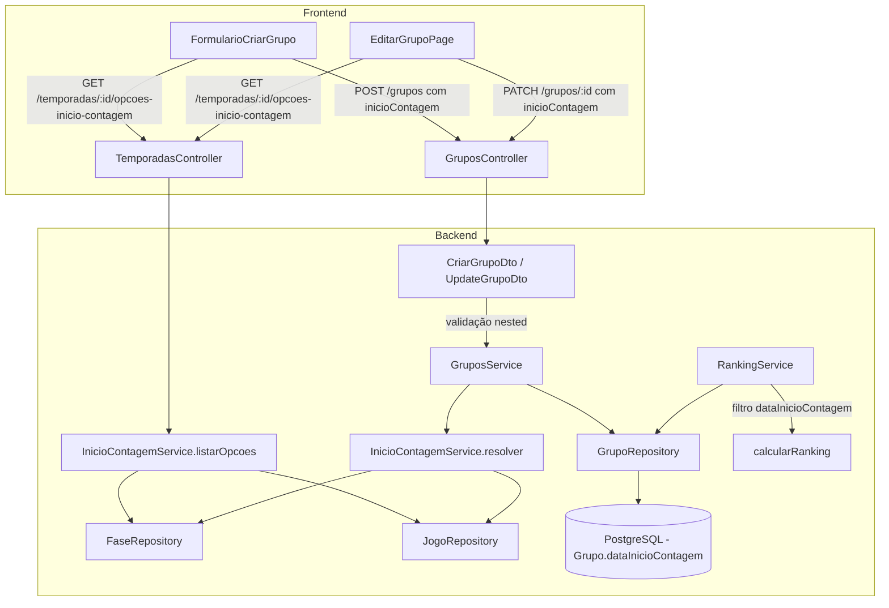

# Design Document — dataInicioContagem (Dropdown + Resolução)

## Overview

Esta feature adiciona o campo `dataInicioContagem` (DateTime nullable) ao model `Grupo`, permitindo que o admin configure a partir de qual rodada/fase os pontos do ranking são contabilizados. Em vez de um input de data manual, o admin seleciona uma opção de um dropdown (rodada específica ou fase eliminatória), e o sistema resolve automaticamente o DateTime do primeiro jogo dessa seleção.

**Decisões de design principais:**

1. **Dropdown em vez de date picker:** O admin não precisa saber datas — ele pensa em rodadas e fases. O sistema calcula a data internamente.
2. **Novo endpoint de opções:** `GET /temporadas/:temporadaId/opcoes-inicio-contagem` retorna as opções disponíveis para popular o dropdown.
3. **Service de resolução:** `InicioContagemService` converte a seleção `{ tipo, faseId, rodada? }` em `Date | null` buscando `MIN(dataHora)` dos jogos.
4. **Filtro na camada de cálculo:** Mantém a mesma abordagem — filtro aplicado no `RankingService.calcularRanking()`, não na query do repositório.
5. **Campo persiste DateTime:** O banco armazena `DateTime?` (não a seleção). Se jogos forem remarcados, a data persiste até o admin re-selecionar.

**Impacto:** Alterações em 2 workspaces (backend + frontend), ~15 arquivos, sem breaking changes na API (campo opcional com default null).

## Architecture



**Fluxo de dados — Criação/Edição:**
1. Frontend carrega opções via `GET /temporadas/:temporadaId/opcoes-inicio-contagem`
2. Admin seleciona opção no dropdown
3. Frontend envia `inicioContagem: { tipo, faseId, rodada? }` ou `null` no payload
4. DTO valida estrutura do objeto nested
5. `GruposService` chama `InicioContagemService.resolver(inicioContagem)` para obter `Date | null`
6. `GruposService` persiste o DateTime resolvido via `GrupoRepository`
7. RankingService busca grupo com `dataInicioContagem`, aplica filtro nos jogos finalizados

**Fluxo de dados — Listagem de opções:**
1. Frontend chama `GET /temporadas/:temporadaId/opcoes-inicio-contagem`
2. `InicioContagemService.listarOpcoes(temporadaId)` busca fases da temporada
3. Para fases PONTOS_CORRIDOS: gera opções por rodada (2 até max)
4. Para fases MATA_MATA: gera opção por fase
5. Retorna array de `OpcaoInicioContagem[]`

## Components and Interfaces

### Backend

#### 1. Prisma Schema (`prisma/schema.prisma`)

```prisma
model Grupo {
  // ... campos existentes
  dataInicioContagem  DateTime?
  // ... relações existentes
}
```

Sem `@@index` necessário — o campo não é usado em queries de listagem/filtro, apenas lido após buscar o grupo por ID.

#### 2. DTOs

**InicioContagemDto** — DTO nested para a seleção:
```typescript
export class InicioContagemDto {
  @IsDefined({ message: 'O campo tipo é obrigatório.' })
  @IsIn(['RODADA', 'FASE'], { message: 'tipo deve ser RODADA ou FASE.' })
  tipo: 'RODADA' | 'FASE';

  @IsDefined({ message: 'O campo faseId é obrigatório.' })
  @IsUUID('4', { message: 'faseId deve ser um UUID válido.' })
  faseId: string;

  @ValidateIf((obj) => obj.tipo === 'RODADA')
  @IsDefined({ message: 'O campo rodada é obrigatório quando tipo é RODADA.' })
  @IsInt({ message: 'rodada deve ser um número inteiro.' })
  @Min(1, { message: 'rodada deve ser no mínimo 1.' })
  rodada?: number;
}
```

**CriarGrupoDto** — adicionar campo:
```typescript
@ApiPropertyOptional({
  description: 'Seleção de início da contagem de pontos (rodada ou fase)',
  type: () => InicioContagemDto,
})
@IsOptional()
@ValidateNested()
@Type(() => InicioContagemDto)
inicioContagem?: InicioContagemDto;
```

**UpdateGrupoDto** — adicionar campo (aceita null para remover):
```typescript
@ApiPropertyOptional({
  description: 'Seleção de início da contagem (null para remover)',
  type: () => InicioContagemDto,
  nullable: true,
})
@IsOptional()
@ValidateIf((obj) => obj.inicioContagem !== null)
@ValidateNested()
@Type(() => InicioContagemDto)
inicioContagem?: InicioContagemDto | null;
```

**Decisão:** Usar `@ValidateNested()` + `@Type()` para validação do objeto aninhado. No UpdateGrupoDto, `@ValidateIf` permite `null` explícito sem disparar validação.

#### 3. InicioContagemService

Novo service dedicado à lógica de resolução e listagem de opções:

```typescript
@Injectable()
export class InicioContagemService {
  constructor(
    @Inject(JOGOS.FASE_REPOSITORY_TOKEN)
    private readonly faseRepo: FaseRepository,
    @Inject(JOGOS.JOGO_REPOSITORY_TOKEN)
    private readonly jogoRepo: JogoRepository,
  ) {}

  /**
   * Resolve a seleção do admin em um DateTime concreto.
   * Retorna MIN(dataHora) dos jogos da combinação fase+rodada.
   * Retorna null se não houver jogos ou todos sem dataHora.
   */
  async resolver(selecao: InicioContagemDto): Promise<Date | null> {
    const fase = await this.faseRepo.buscarPorId(selecao.faseId);
    if (!fase) throw new FaseNaoEncontradaError();

    const jogos = selecao.tipo === 'RODADA'
      ? await this.jogoRepo.buscarPorFase(selecao.faseId, selecao.rodada)
      : await this.jogoRepo.buscarPorFase(selecao.faseId);

    const datasValidas = jogos
      .filter((j: any) => j.dataHora !== null)
      .map((j: any) => new Date(j.dataHora).getTime());

    if (datasValidas.length === 0) {
      this.logger.warn(
        `Nenhuma data encontrada para resolução: fase=${selecao.faseId}, rodada=${selecao.rodada}`
      );
      return null;
    }

    return new Date(Math.min(...datasValidas));
  }

  /**
   * Lista opções de início de contagem para uma temporada.
   * Retorna array ordenado com "Todas as rodadas" + opções por rodada/fase.
   */
  async listarOpcoes(temporadaId: string): Promise<OpcaoInicioContagem[]> {
    const fases = await this.faseRepo.buscarPorTemporada(temporadaId);
    const opcoes: OpcaoInicioContagem[] = [
      { label: 'Todas as rodadas', valor: null },
    ];

    const fasesPontosCorridos = fases.filter((f) => f.tipo === 'PONTOS_CORRIDOS');
    const fasesMataMata = fases.filter((f) => f.tipo === 'MATA_MATA');

    if (fasesPontosCorridos.length === 1) {
      // Brasileirão: 1 fase, múltiplas rodadas
      const fase = fasesPontosCorridos[0];
      const maxRodada = await this.obterMaxRodada(fase.id);
      for (let r = 2; r <= maxRodada; r++) {
        opcoes.push({
          label: `Rodada ${r}`,
          tipo: 'RODADA',
          faseId: fase.id,
          rodada: r,
        });
      }
    } else if (fasesPontosCorridos.length > 1) {
      // Copa do Mundo: múltiplos grupos (PONTOS_CORRIDOS) + eliminatórias
      const primeiraFaseGrupo = fasesPontosCorridos.sort((a, b) => a.ordem - b.ordem)[0];
      const maxRodadaGrupo = await this.obterMaxRodada(primeiraFaseGrupo.id);
      for (let r = 1; r <= maxRodadaGrupo; r++) {
        opcoes.push({
          label: `${r}ª rodada fase de grupos`,
          tipo: 'RODADA',
          faseId: primeiraFaseGrupo.id,
          rodada: r,
        });
      }
    }

    // Fases mata-mata ordenadas por ordem
    for (const fase of fasesMataMata.sort((a, b) => a.ordem - b.ordem)) {
      opcoes.push({
        label: fase.nome,
        tipo: 'FASE',
        faseId: fase.id,
      });
    }

    return opcoes;
  }

  private async obterMaxRodada(faseId: string): Promise<number> {
    const jogos = await this.jogoRepo.buscarPorFase(faseId);
    const rodadas = jogos
      .filter((j: any) => j.rodada !== null)
      .map((j: any) => j.rodada as number);
    return rodadas.length > 0 ? Math.max(...rodadas) : 0;
  }
}
```

**Decisão:** Service separado para isolar a lógica de resolução do `GruposService`. Segue SRP — `GruposService` orquestra CRUD, `InicioContagemService` resolve datas.

#### 4. Tipos para o endpoint de opções

```typescript
export interface OpcaoInicioContagem {
  label: string;
  valor?: null;        // presente apenas na opção "Todas as rodadas"
  tipo?: 'RODADA' | 'FASE';
  faseId?: string;
  rodada?: number;
}
```

#### 5. GruposService — Integração com resolução

Alterar os métodos `criar` e `atualizar`:

```typescript
async criar(dto: CriarGrupoDto, userId: string) {
  // ... validação da temporada existente ...

  let dataInicioContagem: Date | null = null;
  if (dto.inicioContagem) {
    await this.validarFasePertenceTemporada(dto.inicioContagem.faseId, dto.temporadaId);
    dataInicioContagem = await this.inicioContagemService.resolver(dto.inicioContagem);
  }

  const grupo = await this.grupoRepo.criar({
    // ... campos existentes ...
    dataInicioContagem,
  });
  // ...
}

async atualizar(id: string, dto: UpdateGrupoDto) {
  const grupo = await this.grupoRepo.buscarPorIdSimples(id);
  if (!grupo?.ativo) throw new GrupoNaoEncontradoError();

  const dadosAtualizacao: any = {
    nome: dto.nome ?? grupo.nome,
    // ... outros campos ...
  };

  if (dto.inicioContagem !== undefined) {
    if (dto.inicioContagem === null) {
      dadosAtualizacao.dataInicioContagem = null;
    } else {
      await this.validarFasePertenceTemporada(dto.inicioContagem.faseId, grupo.temporadaId);
      dadosAtualizacao.dataInicioContagem =
        await this.inicioContagemService.resolver(dto.inicioContagem);
    }
  }

  return this.grupoRepo.atualizar(id, dadosAtualizacao);
}
```

#### 6. GrupoRepository Interface

```typescript
export interface GrupoRepository {
  criar(data: {
    // ... campos existentes
    dataInicioContagem?: Date | null;
  }): Promise<any>;

  atualizar(id: string, data: Partial<{
    // ... campos existentes
    dataInicioContagem: Date | null;
  }>): Promise<any>;

  // demais métodos sem alteração de assinatura
}
```

#### 7. RankingService — Lógica de Filtragem

Alterar o método privado `calcularRanking` para aplicar filtro de data:

```typescript
private async calcularRanking(
  membros: any[],
  jogosFinalizados: any[],
  grupo: any,
): Promise<RankingEntry[]> {
  if (membros.length === 0) return [];

  const jogosFiltrados = this.filtrarJogosPorDataInicioContagem(
    jogosFinalizados,
    grupo.dataInicioContagem,
  );

  // ... restante do cálculo usa jogosFiltrados em vez de jogosFinalizados
}

private filtrarJogosPorDataInicioContagem(
  jogos: any[],
  dataInicioContagem: Date | null,
): any[] {
  if (!dataInicioContagem) return jogos;

  return jogos.filter((jogo: any) => {
    // Jogos sem data (adiados finalizados) são sempre incluídos
    if (!jogo.dataHora) return true;
    // Incluir se dataHora >= dataInicioContagem
    return new Date(jogo.dataHora).getTime() >= new Date(dataInicioContagem).getTime();
  });
}
```

**Decisão:** Extrair em método privado para manter complexidade cognitiva baixa e facilitar testes de propriedade.

**Não aplicar em `obterDetalhamentoJogo`:** Este método mostra pontuação de um jogo específico independentemente do filtro de ranking.

#### 8. GrupoPresenter

Adicionar `dataInicioContagem` nos métodos `toHttp`, `toHttpMembro` e `toHttpAdmin`:

```typescript
dataInicioContagem: grupo.dataInicioContagem
  ? grupo.dataInicioContagem.toISOString()
  : null,
```

**Não incluir em `toHttpBasico`** — informação administrativa, não relevante para listagem pública.

#### 9. TemporadasController — Novo endpoint

```typescript
@Get(':temporadaId/opcoes-inicio-contagem')
@ApiOperation({ summary: 'Listar opções de início de contagem para a temporada' })
@ApiResponse({ status: 200, description: 'Lista de opções' })
@ApiResponse({ status: 404, description: 'Temporada não encontrada' })
async listarOpcoesInicioContagem(
  @Param('temporadaId', ParseUUIDCustomPipe) temporadaId: string,
): Promise<OpcaoInicioContagem[]> {
  return this.inicioContagemService.listarOpcoes(temporadaId);
}
```

### Frontend

#### 10. Tipo OpcaoInicioContagem (frontend)

```typescript
export interface OpcaoInicioContagem {
  label: string;
  valor?: null;
  tipo?: 'RODADA' | 'FASE';
  faseId?: string;
  rodada?: number;
}

export interface InicioContagemPayload {
  tipo: 'RODADA' | 'FASE';
  faseId: string;
  rodada?: number;
}
```

#### 11. Service de opções (frontend)

```typescript
export async function buscarOpcoesInicioContagem(
  temporadaId: string,
): Promise<OpcaoInicioContagem[]> {
  const response = await api.get(`/temporadas/${temporadaId}/opcoes-inicio-contagem`);
  return response.data;
}
```

#### 12. FormularioCriarGrupo — Dropdown

- Componente `Select` (shadcn/ui) com label "Início da contagem de pontos"
- Carrega opções via `buscarOpcoesInicioContagem(temporadaId)` quando temporada é selecionada
- Estado de loading enquanto busca opções
- Primeira opção "Todas as rodadas" = sem filtro (payload sem campo `inicioContagem`)
- Demais opções enviam `{ tipo, faseId, rodada? }` no payload

#### 13. FormularioEditarGrupo — Dropdown

- Mesmo componente Select, carrega opções via temporada do grupo
- Pré-seleciona baseado no `dataInicioContagem` atual + comparação com opções disponíveis
- Texto auxiliar abaixo: "Jogos finalizados antes da rodada/fase selecionada não serão contabilizados no ranking"
- Ao selecionar "Todas as rodadas": envia `inicioContagem: null`

**Decisão sobre pré-seleção:** Como o banco armazena DateTime (não a seleção original), o frontend precisa inferir qual opção corresponde ao valor atual. Estratégia: comparar `dataInicioContagem` com MIN(dataHora) calculada para cada opção. Se nenhuma opção corresponder exatamente (jogos remarcados), exibir "Personalizado (data manual)" como opção selecionada indicando a data atual.

## Data Models

### Prisma Schema (alteração)

```prisma
model Grupo {
  id                        String           @id @default(uuid())
  nome                      String           @unique @db.VarChar(100)
  temporadaId               String
  criadoPor                 String
  privado                   Boolean
  codigoConvite             String?          @unique @db.VarChar(8)
  icone                     String?
  permitirPalpiteAutomatico Boolean          @default(false)
  maxParticipantes          Int              @default(50)
  ativo                     Boolean          @default(true)
  permitirPalpiteDobrado    Boolean          @default(false)
  dataInicioContagem        DateTime?        // NOVO CAMPO
  dataCriacao               DateTime         @default(now())
  atualizadoEm              DateTime         @updatedAt
  // ... relações
}
```

### Tipo Frontend (grupo.types.ts)

```typescript
export interface Grupo {
  // ... campos existentes
  dataInicioContagem: string | null; // ISO 8601 ou null
}
```

### Payloads de criação/atualização

```typescript
// POST /grupos
interface CriarGrupoPayload {
  // ... campos existentes
  inicioContagem?: {
    tipo: 'RODADA' | 'FASE';
    faseId: string;
    rodada?: number;
  };
}

// PATCH /grupos/:id
interface AtualizarGrupoPayload {
  // ... campos existentes
  inicioContagem?: {
    tipo: 'RODADA' | 'FASE';
    faseId: string;
    rodada?: number;
  } | null; // null = remover, undefined/omitido = manter
}
```

### Response do endpoint de opções

```typescript
// GET /temporadas/:temporadaId/opcoes-inicio-contagem

// Para Brasileirão:
[
  { "label": "Todas as rodadas", "valor": null },
  { "label": "Rodada 2", "tipo": "RODADA", "faseId": "uuid-fase-brasileirao", "rodada": 2 },
  { "label": "Rodada 3", "tipo": "RODADA", "faseId": "uuid-fase-brasileirao", "rodada": 3 },
  // ... até rodada 38
]

// Para Copa do Mundo 2026:
[
  { "label": "Todas as rodadas", "valor": null },
  { "label": "1ª rodada fase de grupos", "tipo": "RODADA", "faseId": "uuid-grupo-a", "rodada": 1 },
  { "label": "2ª rodada fase de grupos", "tipo": "RODADA", "faseId": "uuid-grupo-a", "rodada": 2 },
  { "label": "3ª rodada fase de grupos", "tipo": "RODADA", "faseId": "uuid-grupo-a", "rodada": 3 },
  { "label": "16 Avos", "tipo": "FASE", "faseId": "uuid-16avos" },
  { "label": "Oitavas de Final", "tipo": "FASE", "faseId": "uuid-oitavas" },
  { "label": "Quartas de Final", "tipo": "FASE", "faseId": "uuid-quartas" },
  { "label": "Semifinal", "tipo": "FASE", "faseId": "uuid-semi" },
  { "label": "Disputa de 3º Lugar", "tipo": "FASE", "faseId": "uuid-3lugar" },
  { "label": "Final", "tipo": "FASE", "faseId": "uuid-final" }
]
```

## Correctness Properties

*Uma propriedade é uma característica ou comportamento que deve ser verdadeiro em todas as execuções válidas de um sistema — essencialmente, uma declaração formal sobre o que o sistema deve fazer.*

### Property 1: Sem filtro quando dataInicioContagem é null

*Para qualquer* conjunto de jogos finalizados com datas arbitrárias e qualquer grupo com `dataInicioContagem` igual a `null`, o método `filtrarJogosPorDataInicioContagem` SHALL retornar todos os jogos sem exclusão — ou seja, o array de saída deve ter o mesmo comprimento e conteúdo que o array de entrada.

**Validates: Requirements 3.1**

### Property 2: Filtro correto por data — inclusão se e somente se dataHora >= dataInicioContagem ou dataHora é null

*Para qualquer* `dataInicioContagem` definida e *para qualquer* jogo finalizado, o jogo é incluído no resultado de `filtrarJogosPorDataInicioContagem` se e somente se: (a) `jogo.dataHora` é `null`, ou (b) `jogo.dataHora >= dataInicioContagem`. Jogos com `dataHora` estritamente anterior a `dataInicioContagem` devem ser excluídos.

**Validates: Requirements 3.2, 3.3, 3.4**

### Property 3: Resolução retorna MIN(dataHora) dos jogos da combinação

*Para qualquer* combinação válida de `faseId` + `rodada` (ou apenas `faseId` para tipo FASE), o método `resolver` SHALL retornar um DateTime que é igual ao menor valor de `dataHora` dentre todos os jogos daquela combinação que possuem `dataHora` não-null. Se nenhum jogo tem `dataHora` definido, retorna `null`.

**Validates: Requirements 11.1, 11.2, 11.3, 11.4**

## Error Handling

### Backend

| Cenário | Erro | HTTP Status |
|---------|------|-------------|
| `inicioContagem` com estrutura inválida (tipo, faseId, rodada) | Validação class-validator nested | 400 Bad Request |
| `faseId` não existe | `FaseNaoEncontradaError` | 404 Not Found |
| `faseId` não pertence à temporada do grupo | Domain Error específico | 400 Bad Request |
| `temporadaId` não existe (endpoint opções) | `TemporadaNaoEncontradaError` | 404 Not Found |
| Grupo não encontrado | `GrupoNaoEncontradoError` | 404 Not Found |
| Nenhum jogo encontrado para resolução | Persiste `null` + warning log | 200 (sem erro HTTP) |

**Formato de erro de validação (padrão existente):**
```json
{
  "erros": [
    {
      "campo": "inicioContagem.tipo",
      "mensagens": ["tipo deve ser RODADA ou FASE."]
    },
    {
      "campo": "inicioContagem.rodada",
      "mensagens": ["O campo rodada é obrigatório quando tipo é RODADA."]
    }
  ]
}
```

### Frontend

| Cenário | Tratamento |
|---------|------------|
| Falha ao buscar opções | Mensagem abaixo do dropdown, campo desabilitado |
| Falha na requisição PATCH/POST | Alert no topo do formulário, seleção preservada |
| Nenhuma opção corresponde ao dataInicioContagem atual | Exibir indicador "Personalizado" |

## Testing Strategy

### Abordagem Dual: Testes Unitários + Testes de Propriedade

**Property-Based Testing (PBT)** é aplicável para:
1. Lógica de filtragem do `RankingService` (função pura: jogos + data → jogos filtrados)
2. Lógica de resolução (função: jogos + seleção → MIN(dataHora))

**Biblioteca:** `fast-check` via Vitest

### Testes de Propriedade (Backend — Vitest + fast-check)

Configuração: mínimo 100 iterações por propriedade.

```typescript
// Tag: Feature: data-inicio-contagem, Property 1: Sem filtro quando dataInicioContagem é null
// Tag: Feature: data-inicio-contagem, Property 2: Filtro correto por data
// Tag: Feature: data-inicio-contagem, Property 3: Resolução retorna MIN(dataHora)
```

### Testes Unitários (Backend — Vitest)

1. **RankingService** (instanciação direta com InMemory repos):
   - Grupo com `dataInicioContagem` definido + 2 jogos (um antes, um depois) → ranking conta apenas o posterior
   - Grupo com `dataInicioContagem` null → ranking conta todos os jogos
   - Grupo com `dataInicioContagem` definido + jogo com `dataHora` null → jogo incluído
   - Grupo com `dataInicioContagem` definido + jogo com `dataHora` === `dataInicioContagem` → jogo incluído (fronteira)
   - `obterDetalhamentoJogo` não aplica filtro de `dataInicioContagem`

2. **InicioContagemService**:
   - `resolver` com tipo RODADA e jogos existentes → retorna MIN(dataHora)
   - `resolver` com tipo FASE e jogos existentes → retorna MIN(dataHora)
   - `resolver` com jogos sem dataHora → retorna null
   - `resolver` com faseId inexistente → lança FaseNaoEncontradaError
   - `listarOpcoes` para temporada Brasileirão → retorna "Todas as rodadas" + rodadas 2..N
   - `listarOpcoes` para temporada Copa do Mundo → retorna opções de grupos + eliminatórias

3. **GruposService**:
   - Criação com `inicioContagem` → chama resolver e persiste resultado
   - Criação sem `inicioContagem` → persiste null
   - Atualização com `inicioContagem: null` → persiste null
   - Atualização com `inicioContagem` de fase que não pertence à temporada → erro 400

4. **GrupoPresenter**:
   - `toHttp` com `dataInicioContagem` Date → retorna ISO string
   - `toHttp` com `dataInicioContagem` null → retorna null
   - `toHttpBasico` → não inclui campo

5. **InMemoryGrupoRepository**:
   - Criar sem `dataInicioContagem` → persiste null
   - Atualizar com `dataInicioContagem` null → substitui valor anterior
   - Atualizar sem campo → mantém valor existente

### Testes Unitários (Frontend — Vitest + React Testing Library)

1. **FormularioCriarGrupo**:
   - Dropdown presente na seção avançada
   - Dropdown carrega opções quando temporada selecionada
   - Submit com "Todas as rodadas" → payload sem campo inicioContagem
   - Submit com opção específica → payload com { tipo, faseId, rodada }
   - Estado loading enquanto busca opções

2. **EditarGrupoPage**:
   - Dropdown carrega opções e pré-seleciona baseado em dataInicioContagem
   - Selecionar "Todas as rodadas" e submeter → payload com inicioContagem: null
   - Texto auxiliar visível
   - Erro de requisição → mensagem exibida, seleção preservada
