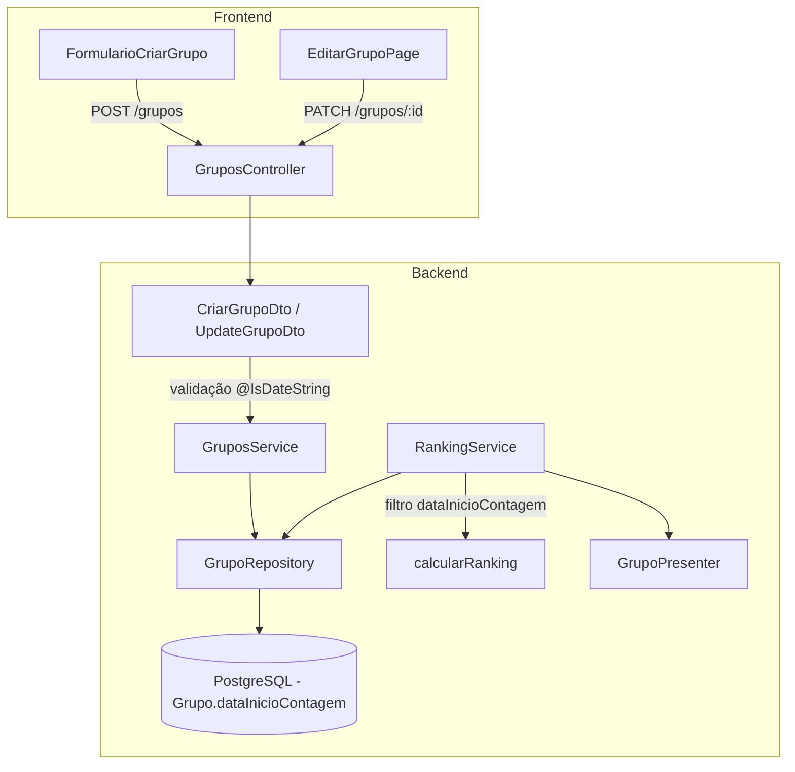

# Design Document — dataInicioContagem

## Overview

Esta feature adiciona o campo `dataInicioContagem` (DateTime nullable) ao model `Grupo`, permitindo que o admin configure a partir de qual data os pontos do ranking são contabilizados. A lógica de filtragem é aplicada no cálculo on-the-fly do `RankingService`, sem necessidade de reprocessamento ou tabelas auxiliares.

**Decisão de design principal:** O filtro é aplicado na camada de cálculo (método privado `calcularRanking`) e não na camada de query do repositório. Isso mantém a simplicidade do repositório e centraliza a regra de negócio no service, alinhado com o padrão existente onde `jogosFinalizados` já é filtrado em memória.

**Impacto:** Alterações em 2 workspaces (backend + frontend), 10+ arquivos, sem breaking changes na API (campo opcional com default null).

## Architecture



**Fluxo de dados:**
1. Frontend envia `dataInicioContagem` (ISO 8601 string ou null) no body
2. DTO valida formato com `@IsDateString`
3. Service repassa ao Repository sem transformação
4. Prisma persiste como `DateTime?`
5. RankingService busca grupo com `dataInicioContagem`, aplica filtro nos jogos finalizados antes de calcular pontuação
6. Presenter expõe como ISO string ou null na resposta

## Components and Interfaces

### Backend

#### 1. Prisma Schema (`prisma/schema.prisma`)

```prisma
model Grupo {
  // ... campos existentes
  dataInicioContagem  DateTime?
  // ... relações existentes
}
```

Sem `@@index` necessário — o campo não é usado em queries de listagem/filtro, apenas lido após buscar o grupo por ID.

#### 2. DTOs

**CriarGrupoDto** — adicionar campo:
```typescript
@ApiPropertyOptional({ 
  description: 'Data de início da contagem de pontos no ranking',
  example: '2025-03-01T00:00:00.000Z' 
})
@IsOptional()
@IsDateString({}, { message: 'dataInicioContagem deve ser uma data válida no formato ISO 8601' })
dataInicioContagem?: string;
```

**UpdateGrupoDto** — adicionar campo idêntico ao CriarGrupoDto. Para suportar envio explícito de `null` (remover data de corte):
```typescript
@ApiPropertyOptional({ 
  description: 'Data de início da contagem de pontos no ranking (null para remover)',
  example: '2025-03-01T00:00:00.000Z',
  nullable: true
})
@IsOptional()
@ValidateIf((obj) => obj.dataInicioContagem !== null)
@IsDateString({}, { message: 'dataInicioContagem deve ser uma data válida no formato ISO 8601' })
dataInicioContagem?: string | null;
```

**Decisão:** Usar `@ValidateIf` no UpdateGrupoDto para permitir `null` explícito sem disparar validação de `@IsDateString`. No CriarGrupoDto, `null` não precisa ser enviado (campo simplesmente omitido).

#### 3. GrupoRepository Interface

```typescript
export interface GrupoRepository {
  criar(data: {
    // ... campos existentes
    dataInicioContagem?: Date | null;
  }): Promise<any>;
  
  atualizar(id: string, data: Partial<{
    // ... campos existentes
    dataInicioContagem: Date | null;
  }>): Promise<any>;
  
  // demais métodos sem alteração de assinatura
}
```

**PrismaGrupoRepository:** Sem transformação — Prisma já lida com `DateTime?` nativamente.

**InMemoryGrupoRepository:** Armazenar `dataInicioContagem: data.dataInicioContagem ?? null` na criação. No `atualizar`, aplicar spread parcial (comportamento existente já cobre).

#### 4. RankingService — Lógica de Filtragem

Alterar o método privado `calcularRanking` para aplicar filtro de data:

```typescript
private async calcularRanking(
  membros: any[],
  jogosFinalizados: any[],
  grupo: any,
): Promise<RankingEntry[]> {
  if (membros.length === 0) return [];

  const jogosFiltrados = this.filtrarJogosPorDataInicioContagem(
    jogosFinalizados, 
    grupo.dataInicioContagem
  );

  // ... restante do cálculo usa jogosFiltrados em vez de jogosFinalizados
}

private filtrarJogosPorDataInicioContagem(
  jogos: any[],
  dataInicioContagem: Date | null,
): any[] {
  if (!dataInicioContagem) return jogos;

  return jogos.filter((jogo: any) => {
    // Jogos sem data (adiados finalizados) são sempre incluídos
    if (!jogo.dataHora) return true;
    // Incluir se dataHora >= dataInicioContagem
    return new Date(jogo.dataHora).getTime() >= new Date(dataInicioContagem).getTime();
  });
}
```

**Decisão:** Extrair em método privado `filtrarJogosPorDataInicioContagem` para:
- Manter complexidade cognitiva baixa
- Facilitar testes (lógica isolada e determinística)
- Reutilizar em `obterRankingFase` e `obterRankingGeral` (ambos chamam `calcularRanking`)

**Não aplicar em `obterDetalhamentoJogo`:** Este método mostra pontuação de um jogo específico independentemente do filtro de ranking.

#### 5. GrupoPresenter

Adicionar `dataInicioContagem` nos métodos `toHttp`, `toHttpMembro` e `toHttpAdmin`:

```typescript
dataInicioContagem: grupo.dataInicioContagem 
  ? grupo.dataInicioContagem.toISOString() 
  : null,
```

**Não incluir em `toHttpBasico`** — informação administrativa, não relevante para listagem pública.

Atualizar interface `GrupoBase`:
```typescript
interface GrupoBase {
  // ... campos existentes
  dataInicioContagem: Date | null;
}
```

### Frontend

#### 6. FormularioCriarGrupo

Adicionar campo de data na seção "Configurações avançadas":
- Input type `date` com label "Data de início da contagem"
- Validação Zod: `z.string().optional()` com refinamento para data entre 2020-01-01 e hoje
- Conversão para ISO 8601 no submit: `new Date(valor).toISOString()` ou omitir se vazio
- Placeholder: formato dd/mm/aaaa (nativo do input date)

Schema Zod adicional:
```typescript
dataInicioContagem: z.string().optional().refine(
  (val) => {
    if (!val) return true;
    const data = new Date(val);
    return data >= new Date('2020-01-01') && data <= new Date();
  },
  { message: 'Data deve estar entre 01/01/2020 e hoje' }
),
```

#### 7. EditarGrupoPage

Adicionar campo na seção "Regras do bolão":
- Input type `date` com label "Data de início da contagem"
- Preenchido com valor atual do grupo (convertido de ISO para YYYY-MM-DD)
- Texto auxiliar abaixo: "Jogos finalizados antes desta data não serão contabilizados no ranking"
- Ao limpar: enviar `null` no payload
- Mesma validação Zod do formulário de criação, mas permitindo `null`

## Data Models

### Prisma Schema (alteração)

```prisma
model Grupo {
  id                        String           @id @default(uuid())
  nome                      String           @unique @db.VarChar(100)
  temporadaId               String
  criadoPor                 String
  privado                   Boolean
  codigoConvite             String?          @unique @db.VarChar(8)
  icone                     String?
  permitirPalpiteAutomatico Boolean          @default(false)
  maxParticipantes          Int              @default(50)
  ativo                     Boolean          @default(true)
  permitirPalpiteDobrado    Boolean          @default(false)
  dataInicioContagem        DateTime?        // NOVO CAMPO
  dataCriacao               DateTime         @default(now())
  atualizadoEm              DateTime         @updatedAt
  // ... relações
}
```

### Tipo Frontend (grupo.types.ts)

```typescript
export interface Grupo {
  // ... campos existentes
  dataInicioContagem: string | null; // ISO 8601 ou null
}
```

### Payload de criação/atualização

```typescript
// POST /grupos
interface CriarGrupoPayload {
  // ... campos existentes
  dataInicioContagem?: string; // ISO 8601, omitido = null
}

// PATCH /grupos/:id
interface AtualizarGrupoPayload {
  // ... campos existentes
  dataInicioContagem?: string | null; // ISO 8601, null = remover, omitido = manter
}
```

## Correctness Properties

*Uma propriedade é uma característica ou comportamento que deve ser verdadeiro em todas as execuções válidas de um sistema — essencialmente, uma declaração formal sobre o que o sistema deve fazer. Propriedades servem como ponte entre especificações legíveis por humanos e garantias de corretude verificáveis por máquina.*

### Property 1: Sem filtro quando dataInicioContagem é null

*Para qualquer* conjunto de jogos finalizados com datas arbitrárias e qualquer grupo com `dataInicioContagem` igual a `null`, o método `filtrarJogosPorDataInicioContagem` SHALL retornar todos os jogos sem exclusão — ou seja, o array de saída deve ter o mesmo comprimento e conteúdo que o array de entrada.

**Validates: Requirements 3.1**

### Property 2: Filtro correto por data — inclusão se e somente se dataHora >= dataInicioContagem ou dataHora é null

*Para qualquer* `dataInicioContagem` definida e *para qualquer* jogo finalizado, o jogo é incluído no resultado de `filtrarJogosPorDataInicioContagem` se e somente se: (a) `jogo.dataHora` é `null`, ou (b) `jogo.dataHora >= dataInicioContagem`. Jogos com `dataHora` estritamente anterior a `dataInicioContagem` devem ser excluídos.

**Validates: Requirements 3.2, 3.3, 3.4**

## Error Handling

### Backend

| Cenário | Erro | HTTP Status |
|---------|------|-------------|
| `dataInicioContagem` com formato inválido | Validação class-validator | 400 Bad Request |
| Grupo não encontrado ao buscar ranking | `GrupoNaoEncontradoError` | 404 Not Found |

**Formato de erro de validação (padrão existente):**
```json
{
  "erros": [
    {
      "campo": "dataInicioContagem",
      "mensagens": ["dataInicioContagem deve ser uma data válida no formato ISO 8601"]
    }
  ]
}
```

### Frontend

| Cenário | Tratamento |
|---------|------------|
| Data futura selecionada | Mensagem inline abaixo do campo, botão desabilitado |
| Data anterior a 2020 | Mensagem inline abaixo do campo, botão desabilitado |
| Falha na requisição PATCH | Alert no topo do formulário, valores preservados |
| Falha na requisição POST | Alert no topo do formulário (comportamento existente) |

## Testing Strategy

### Abordagem Dual: Testes Unitários + Testes de Propriedade

**Property-Based Testing (PBT)** é aplicável para a lógica de filtragem do `RankingService`, pois:
- É uma função pura (entrada: jogos + dataInicioContagem → saída: jogos filtrados)
- Comportamento varia significativamente com input (datas, null, combinações)
- 100+ iterações revelam edge cases (datas iguais, null, limites)

**Biblioteca:** `fast-check` (já disponível no frontend; para backend usar via Vitest)

### Testes de Propriedade (Backend — Vitest + fast-check)

Configuração: mínimo 100 iterações por propriedade.

```typescript
// Tag: Feature: data-inicio-contagem, Property 1: Sem filtro quando dataInicioContagem é null
// Tag: Feature: data-inicio-contagem, Property 2: Filtro correto por data
```

### Testes Unitários (Backend — Vitest)

1. **RankingService** (instanciação direta com InMemory repos):
   - Grupo com `dataInicioContagem` definido + 2 jogos (um antes, um depois) → ranking conta apenas o posterior
   - Grupo com `dataInicioContagem` null → ranking conta todos os jogos
   - Grupo com `dataInicioContagem` definido + jogo com `dataHora` null → jogo incluído
   - Grupo com `dataInicioContagem` definido + jogo com `dataHora` === `dataInicioContagem` → jogo incluído (fronteira)
   - `obterDetalhamentoJogo` não aplica filtro de `dataInicioContagem`

2. **GruposController** (mock service):
   - DTO de criação com `dataInicioContagem` → repassa ao service
   - DTO de atualização com `dataInicioContagem` → repassa ao service

3. **GrupoPresenter**:
   - `toHttp` com `dataInicioContagem` Date → retorna ISO string
   - `toHttp` com `dataInicioContagem` null → retorna null
   - `toHttpBasico` → não inclui campo

4. **InMemoryGrupoRepository**:
   - Criar sem `dataInicioContagem` → persiste null
   - Atualizar com `dataInicioContagem` null → substitui valor anterior
   - Atualizar sem campo → mantém valor existente

### Testes Unitários (Frontend — Vitest + React Testing Library)

1. **FormularioCriarGrupo**:
   - Campo de data presente na seção avançada
   - Submit sem data → payload sem campo
   - Submit com data válida → payload com ISO string
   - Data futura → erro de validação exibido

2. **EditarGrupoPage**:
   - Campo preenchido com valor existente do grupo
   - Limpar campo e submeter → payload com null
   - Texto auxiliar visível
   - Erro de requisição → mensagem exibida, valores preservados
