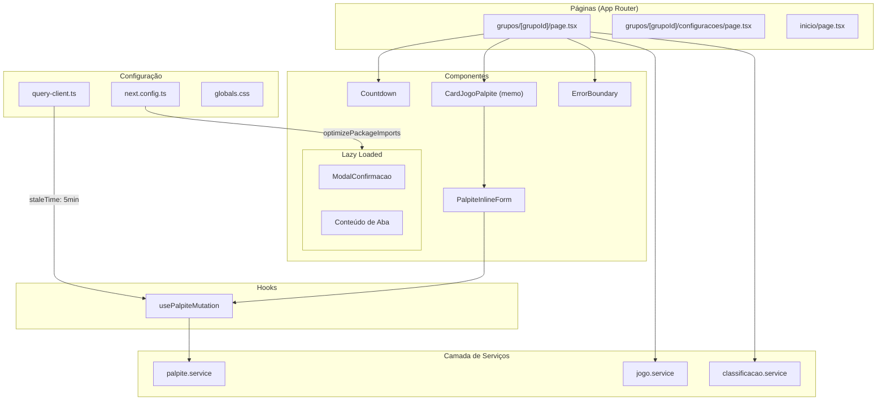
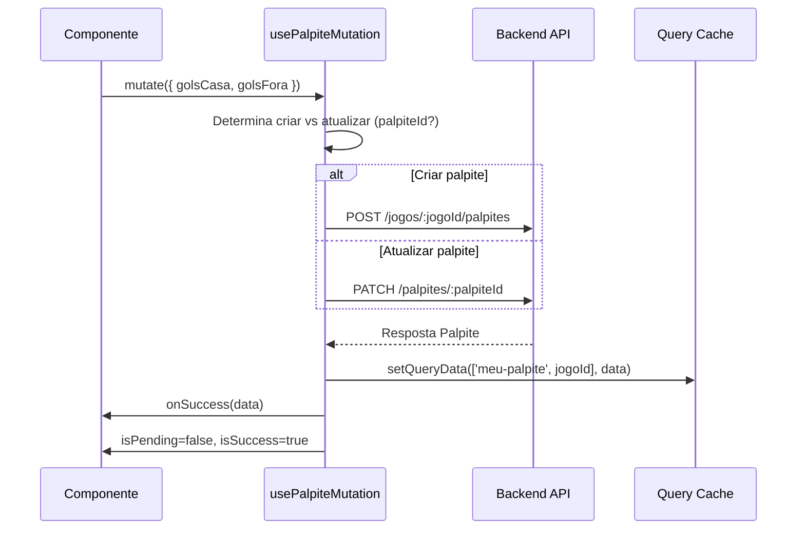

# Documento de Design: Frontend Optimizations

## Visão Geral

Este documento descreve o design técnico para as otimizações de performance e qualidade de código do frontend do Bolão. As mudanças abrangem isolamento de re-renders, memoização, unificação de lógica duplicada, error boundaries, lazy loading, correções de configuração e remoção de código morto.

O projeto utiliza Next.js 15 (App Router), React 19, TypeScript, TanStack React Query v5, Tailwind CSS v4, Zustand e Vitest + fast-check para testes.

### Princípios de Design

1. **Isolamento de estado**: Componentes que atualizam frequentemente (countdown) devem ser isolados para evitar cascata de re-renders
2. **DRY (Don't Repeat Yourself)**: Lógica de mutação duplicada em 3 locais deve ser unificada em um hook
3. **Resiliência**: Error Boundaries garantem que falhas parciais não derrubam a página inteira
4. **Performance de carregamento**: Lazy loading e otimizações de bundle reduzem o tempo de First Contentful Paint
5. **Consistência**: Serviços devem seguir o mesmo padrão de tratamento de erros

## Arquitetura



### Fluxo de Dados — usePalpiteMutation



## Componentes e Interfaces

### 1. Componente Countdown

```typescript
// src/components/ui/countdown.tsx
interface CountdownProps {
  readonly targetDate: string; // ISO 8601
  readonly onExpire?: () => void;
}

/**
 * Componente isolado que atualiza a cada segundo sem causar
 * re-render no componente pai. Usa useEffect com setInterval.
 */
export function Countdown({ targetDate, onExpire }: CountdownProps): JSX.Element;
```

**Função pura interna (testável como property):**
```typescript
/**
 * Formata a diferença em ms para "HH:MM:SS" com zero-padding.
 * Horas podem exceder 99 para countdowns longos.
 */
export function formatCountdown(diffMs: number): string;
```

### 2. CardJogoPalpite com React.memo

```typescript
// src/components/jogos/card-jogo-palpite.tsx
interface CardJogoPalpiteProps {
  readonly jogo: Jogo;
  readonly palpitavel: boolean;
  readonly grupoId: string;
  readonly ativo: boolean;
  readonly onFoco?: () => void;
}

/**
 * Função de comparação customizada para React.memo.
 * Compara: jogo.id, jogo.status, jogo.golsCasa, jogo.golsFora,
 * jogo.dataHora, palpitavel, grupoId, ativo.
 * Exclui: onFoco (nova referência a cada render do pai).
 */
export function areCardPropsEqual(
  prev: CardJogoPalpiteProps,
  next: CardJogoPalpiteProps
): boolean;

export const CardJogoPalpite = React.memo(CardJogoPalpiteInternal, areCardPropsEqual);
```

### 3. Hook usePalpiteMutation

```typescript
// src/hooks/use-palpite-mutation.ts
interface UsePalpiteMutationOptions {
  jogoId: string;
  palpiteId?: string;
  onSuccess?: (palpite: Palpite) => void;
}

interface UsePalpiteMutationReturn {
  mutate: (dados: { golsCasa: number; golsFora: number }) => void;
  isPending: boolean;
  isSuccess: boolean;
  error: Error | null;
}

export function usePalpiteMutation(options: UsePalpiteMutationOptions): UsePalpiteMutationReturn;
```

### 4. Componente ErrorBoundary

```typescript
// src/components/ui/error-boundary.tsx
interface ErrorBoundaryProps {
  readonly sectionName: string;
  readonly children: React.ReactNode;
  readonly fallbackClassName?: string;
}

/**
 * Class component que captura erros de renderização.
 * Exibe fallback com nome da seção e botão "Tentar novamente".
 * Loga erro no console.
 */
export class ErrorBoundary extends React.Component<ErrorBoundaryProps, ErrorBoundaryState>;
```

### 5. Sub-componentes extraídos

```typescript
// src/components/grupo/secao-proximo-jogo.tsx
interface SecaoProximoJogoProps {
  readonly proximoJogo: { fase: Fase; jogo: Jogo };
  readonly classificacao?: ClassificacaoTime[];
  readonly grupoId: string;
  readonly countdown: string;
}

// src/components/grupo/secao-ranking.tsx
interface SecaoRankingProps {
  readonly rankingAtivo: RankingItem[] | undefined;
  readonly rankingFiltro: 'geral' | 'rodada';
  readonly onFiltroChange: (filtro: 'geral' | 'rodada') => void;
  // ... demais props de controle
}

// src/components/grupo/secao-membros.tsx (para configurações)
interface SecaoMembrosProps {
  readonly membros: Membro[];
  readonly maxParticipantes: number;
  readonly onRemover: (id: string) => void;
  readonly onPromover: (id: string) => void;
  readonly onRebaixar: (id: string) => void;
}
```

## Modelos de Dados

### Modelos existentes (sem alteração)

```typescript
// types/palpite.types.ts (já existe)
interface Palpite {
  id: string;
  jogoId: string;
  golsCasa: number;
  golsFora: number;
  usuarioId: string;
  createdAt: string;
  updatedAt: string;
}

interface DadosCriarPalpite {
  golsCasa: number;
  golsFora: number;
}

interface DadosAtualizarPalpite {
  golsCasa: number;
  golsFora: number;
}
```

### Configuração de Query Cache (alteração)

```typescript
// src/lib/query-client.ts
export const queryClient = new QueryClient({
  defaultOptions: {
    queries: {
      staleTime: 5 * 60 * 1000, // 5 minutos (mantém)
      retry: 1,
      refetchOnWindowFocus: true, // ALTERADO: habilitar refetch on focus
    },
  },
});
```

### Configuração de Bundle (alteração)

```typescript
// next.config.ts — adições
const nextConfig: NextConfig = {
  // ... existente
  experimental: {
    optimizePackageImports: ['lucide-react'],
  },
  compiler: {
    removeConsole: process.env.NODE_ENV === 'production'
      ? { exclude: ['warn', 'error'] }
      : false,
  },
};
```

## Propriedades de Corretude

*Uma propriedade é uma característica ou comportamento que deve ser verdadeiro em todas as execuções válidas de um sistema — essencialmente, uma declaração formal sobre o que o sistema deve fazer.*

### Propriedade 1: Formatação do Countdown produz HH:MM:SS válido

*Para qualquer* inteiro positivo representando milissegundos restantes (0 < diffMs ≤ 999_999_999), a função `formatCountdown` DEVE produzir uma string correspondendo ao padrão `^\d{2,}:\d{2}:\d{2}$` onde o componente de minutos está entre 00-59, o componente de segundos está entre 00-59, e os valores numéricos satisfazem: `hours * 3600000 + minutes * 60000 + seconds * 1000 ≤ diffMs < hours * 3600000 + minutes * 60000 + (seconds + 1) * 1000`.

**Valida: Requisito 1.3**

### Propriedade 2: Corretude da função de comparação do CardJogoPalpite

*Para quaisquer* dois objetos CardJogoPalpiteProps onde jogo.id, jogo.status, jogo.golsCasa, jogo.golsFora, jogo.dataHora, palpitavel, grupoId e ativo são todos estritamente iguais, a função `areCardPropsEqual` DEVE retornar true independente da referência de onFoco. Inversamente, *para quaisquer* dois objetos de props onde pelo menos um desses campos difere, a função DEVE retornar false.

**Valida: Requisitos 2.3, 2.4**

### Propriedade 3: Catching seletivo de erros em buscarMeuPalpite

*Para qualquer* erro HTTP com status code 404, `buscarMeuPalpite` DEVE retornar null. *Para qualquer* erro HTTP com status code diferente de 404 (ex: 400, 401, 403, 500, 502, 503), `buscarMeuPalpite` DEVE propagar o erro (throw) ao chamador.

**Valida: Requisito 8.6**

## Tratamento de Erros

### Estratégia por Camada

| Camada | Estratégia | Detalhes |
|--------|-----------|----------|
| **Camada de Serviços** | Propagação | Erros são propagados ao caller sem try/catch, exceto quando há fallback documentado (ex: 404 → null) |
| **Hooks (React Query)** | Estado reativo | `useMutation` e `useQuery` expõem `error`, `isError` para a UI reagir |
| **Componentes** | Error Boundary | Cada seção query-dependent é envolvida por um ErrorBoundary independente |
| **Dynamic Imports** | Fallback inline | Componentes lazy que falham exibem mensagem de erro com botão retry |

### Padrão de Serviço — Antes vs Depois

**Antes (classificacao.service.ts):**
```typescript
export async function buscarClassificacao(): Promise<ClassificacaoTime[]> {
  try {
    const { default: apiClient } = await import('@/lib/api-client'); // ❌ dinâmico
    const response = await apiClient.get('/classificacao');
    return response.data;
  } catch {
    return []; // ❌ engole erro, retorna fallback indistinguível
  }
}
```

**Depois:**
```typescript
import apiClient from '@/lib/api-client'; // ✅ estático

export async function buscarClassificacao(season?: number): Promise<ClassificacaoTime[]> {
  const params: Record<string, unknown> = {};
  if (season) params.season = season;
  const response = await apiClient.get<ClassificacaoTime[]>('/classificacao', { params });
  return response.data; // ✅ propaga erro ao caller
}
```

### Padrão de buscarMeuPalpite (exceção documentada)

```typescript
export async function buscarMeuPalpite(jogoId: string): Promise<Palpite | null> {
  try {
    const response = await apiClient.get<Palpite>(`/jogos/${jogoId}/meu-palpite`);
    return response.data;
  } catch (error: unknown) {
    // Retorna null apenas para 404 (usuário ainda não palpitou).
    // Todos os outros erros são propagados ao caller.
    if (isAxiosError(error) && error.response?.status === 404) {
      return null;
    }
    throw error;
  }
}
```

### Error Boundary — Comportamento

1. Captura erros de renderização nos filhos
2. Exibe fallback: `"Erro ao carregar {sectionName}"` + botão "Tentar novamente"
3. Loga `console.error(error.message, componentStack)` 
4. Retry: reseta `hasError` state, tenta re-render dos children
5. Se falhar novamente, exibe o mesmo fallback (retry infinito disponível)

## Estratégia de Testes

### Abordagem Dual

- **Testes unitários (Vitest + Testing Library)**: Exemplos específicos, edge cases, integração de hooks
- **Testes de propriedade (Vitest + fast-check)**: Propriedades universais para funções puras

### Testes de Propriedade (PBT)

Biblioteca: **fast-check** (já instalada no projeto como devDependency)

Configuração: mínimo 100 iterações por propriedade.

| Propriedade | Arquivo de Teste | Tag |
|-------------|-----------------|-----|
| Propriedade 1: Formatação Countdown | `src/components/ui/__tests__/countdown.property.test.ts` | Feature: frontend-optimizations, Property 1 |
| Propriedade 2: Função de comparação | `src/components/jogos/__tests__/card-jogo-palpite.property.test.ts` | Feature: frontend-optimizations, Property 2 |
| Propriedade 3: Catching seletivo | `src/services/__tests__/palpite.service.property.test.ts` | Feature: frontend-optimizations, Property 3 |

### Testes Unitários (Exemplos)

| Componente/Hook | Cenários |
|----------------|----------|
| Countdown | Monta com data futura → exibe HH:MM:SS; data passada → "Encerrado"; unmount → clearInterval |
| ErrorBoundary | Erro em filho → fallback; retry → re-render; log no console |
| usePalpiteMutation | Fluxo de criação; Fluxo de atualização; Estados isPending; Callback onSuccess |
| Lazy loading | Placeholder durante loading; erro de rede → mensagem + retry |

### Testes Smoke (Verificação de Build)

| Verificação | Comando |
|-------------|---------|
| Compilação TypeScript | `npx tsc --noEmit` |
| Build de produção | `npm run build` |
| Lint | `npm run lint` |

### Testes de Integração

| Cenário | Abordagem |
|---------|-----------|
| Cache refetch on window focus | React Testing Library + fake timers + mock API |
| Propagação de erros nos services | MSW (Mock Service Worker) para simular erros HTTP |
| Falha de dynamic import | Mock de import() rejeitado |

### Estrutura de Arquivos de Teste

```
src/
├── components/
│   ├── ui/__tests__/
│   │   ├── countdown.test.tsx
│   │   ├── countdown.property.test.ts
│   │   └── error-boundary.test.tsx
│   └── jogos/__tests__/
│       └── card-jogo-palpite.property.test.ts
├── hooks/__tests__/
│   └── use-palpite-mutation.test.tsx
└── services/__tests__/
    ├── palpite.service.property.test.ts
    ├── classificacao.service.test.ts
    └── jogo.service.test.ts
```
