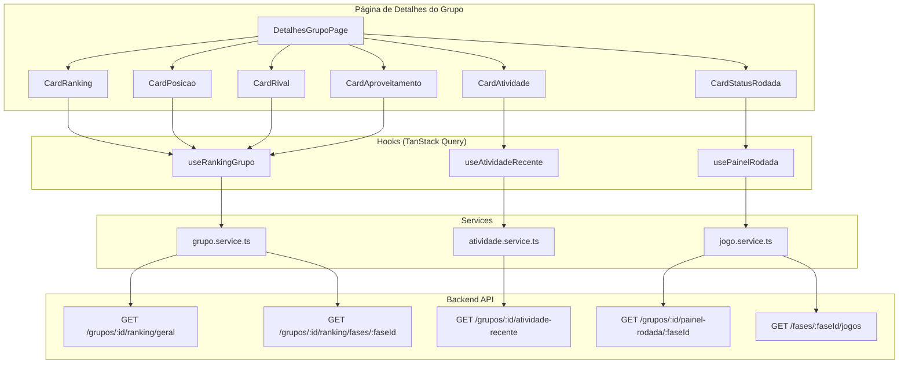
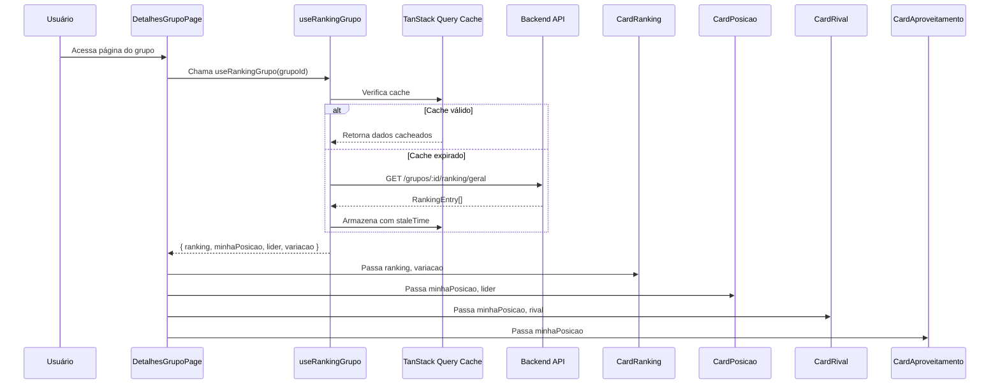
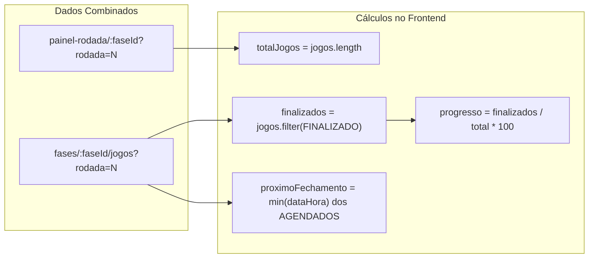

# Documento de Design — Cards do Painel de Grupo

## Visão Geral

Este documento descreve o design técnico para a implementação dos cards do painel de detalhes de grupo. O objetivo é aprimorar os cards existentes (Ranking e Sua Posição) e criar novos cards (Atividade Recente, Rival Direto, Status da Rodada e Aproveitamento) para aumentar o engajamento e a experiência visual dos usuários.

### Escopo

**Frontend (Next.js 15):**
- Refatorar o card de Ranking com pódio visual, destaque do usuário logado e variação de posição
- Refatorar o card Sua Posição com barra de progresso, sequência de pontuação e visual aprimorado
- Criar novos componentes: CardAtividade, CardRival, CardStatusRodada, CardAproveitamento
- Implementar hooks customizados com TanStack Query para compartilhamento de dados entre cards

**Backend (NestJS 11):**
- Novo endpoint `GET /grupos/:grupoId/atividade-recente` para feed de atividades
- Novo campo `sequenciaPontuacao` no endpoint de ranking ou endpoint dedicado
- Geração de eventos de atividade computados on-the-fly a partir de dados existentes

### Decisões de Design

| Decisão | Escolha | Justificativa |
|---------|---------|---------------|
| Arquitetura de componentes | Componentes separados por card | Facilita manutenção, testes e lazy loading individual |
| Compartilhamento de dados | Hooks customizados com TanStack Query | Evita re-fetch; múltiplos cards consomem o mesmo cache |
| Atividade recente (backend) | Computada on-the-fly | Evita nova tabela/event log; dados já existem no sistema |
| Sequência de pontuação | Campo adicional no ranking geral | Evita endpoint extra; dado é derivado do ranking por rodada |
| Variação de posição | Calculada no frontend | Já existe lógica no page.tsx; ranking anterior já é fetched |

---

## Arquitetura

### Diagrama de Componentes



### Diagrama de Fluxo de Dados



---

## Componentes e Interfaces

### Estrutura de Arquivos

```
src/
├── components/
│   └── grupo/
│       ├── cards/
│       │   ├── card-ranking.tsx
│       │   ├── card-posicao.tsx
│       │   ├── card-atividade.tsx
│       │   ├── card-rival.tsx
│       │   ├── card-status-rodada.tsx
│       │   └── card-aproveitamento.tsx
│       └── ...
├── hooks/
│   ├── useRankingGrupo.ts
│   ├── useAtividadeRecente.ts
│   └── usePainelRodada.ts
├── services/
│   ├── grupo.service.ts (existente — adicionar sequência)
│   └── atividade.service.ts (novo)
└── types/
    ├── grupo.types.ts (existente — estender)
    └── atividade.types.ts (novo)
```

### Interfaces dos Componentes

```typescript
// CardRanking
interface CardRankingProps {
  grupoId: string;
  ranking: RankingEntry[];
  rankingAnterior?: RankingEntry[];
  usuarioLogadoId: string;
  filtro: 'geral' | 'rodada';
  onFiltroChange: (filtro: 'geral' | 'rodada') => void;
}

// CardPosicao
interface CardPosicaoProps {
  minhaPosicao: RankingEntry;
  lider: RankingEntry;
  variacao: number;
  sequenciaPontuacao: number;
}

// CardAtividade
interface CardAtividadeProps {
  grupoId: string;
}

// CardRival
interface CardRivalProps {
  minhaPosicao: RankingEntry;
  rival: RankingEntry | null;
  usuarioEhLider: boolean;
}

// CardStatusRodada
interface CardStatusRodadaProps {
  grupoId: string;
  faseId: string;
  rodadaAtual: number;
}

// CardAproveitamento
interface CardAproveitamentoProps {
  minhaPosicao: RankingEntry;
  totalJogosComPalpite: number;
}
```

### Hooks Customizados

```typescript
// useRankingGrupo — centraliza dados de ranking para múltiplos cards
function useRankingGrupo(grupoId: string, usuarioId: string) {
  // Retorna: ranking, minhaPosicao, lider, rival, variacao, sequenciaPontuacao
  // Usa staleTime: 60s para ranking geral
}

// useAtividadeRecente — feed de atividades
function useAtividadeRecente(grupoId: string) {
  // Retorna: eventos[], isLoading, error
  // Usa staleTime: 30s (dados mudam frequentemente)
}

// usePainelRodada — status da rodada atual
function usePainelRodada(grupoId: string, faseId: string, rodada?: number) {
  // Retorna: jogos[], jogosFinalizados, totalJogos, proximoFechamento
  // Usa staleTime: 30s
}
```

---

## Modelos de Dados

### Frontend — Novos Tipos

```typescript
// src/types/atividade.types.ts
export type TipoAtividade =
  | 'PALPITES_FEITOS'
  | 'SUBIU_RANKING'
  | 'ACERTO_EM_CHEIO'
  | 'LIDER_MUDOU';

export interface EventoAtividade {
  id: string;
  tipo: TipoAtividade;
  usuarioId: string;
  nomeUsuario: string;
  descricao: string;
  criadoEm: string; // ISO date
}
```

```typescript
// Extensão de RankingEntry (src/types/grupo.types.ts)
export interface RankingEntry {
  posicao: number;
  usuarioId: string;
  nomeUsuario: string;
  pontuacaoTotal: number;
  acertosEmCheio: number;
  acertosDeResultado: number;
  acertosDeGolsUmTime: number;
  errosTotais: number;
}

// Novo tipo para ranking com sequência (resposta do endpoint atualizado)
export interface RankingComSequencia extends RankingEntry {
  sequenciaPontuacao: number;
}
```

### Backend — Endpoint Atividade Recente

**Rota:** `GET /grupos/:grupoId/atividade-recente`

**Resposta:**
```json
[
  {
    "id": "uuid-gerado",
    "tipo": "ACERTO_EM_CHEIO",
    "usuarioId": "uuid",
    "nomeUsuario": "Lucas",
    "descricao": "Lucas acertou o placar exato!",
    "criadoEm": "2024-01-15T14:30:00Z"
  }
]
```

**Lógica de geração (computada on-the-fly):**

O endpoint não persiste eventos. Ele computa atividades recentes a partir de dados existentes:

1. **PALPITES_FEITOS**: Consulta palpites criados nas últimas 24h por membros do grupo
2. **SUBIU_RANKING**: Compara ranking atual vs ranking da rodada anterior; membros que subiram geram evento
3. **ACERTO_EM_CHEIO**: Consulta pontuações de jogos recentes finalizados; filtra acertos em cheio
4. **LIDER_MUDOU**: Compara líder atual vs líder da rodada anterior

**Ordenação:** Por `criadoEm` descendente, limitado a 10 eventos.

### Backend — Sequência de Pontuação

**Abordagem:** Adicionar campo `sequenciaPontuacao` na resposta do endpoint `GET /grupos/:grupoId/ranking/geral`.

**Lógica de cálculo:**
1. Buscar todas as rodadas da fase atual (ordenadas da mais recente para a mais antiga)
2. Para cada membro, calcular pontuação por rodada
3. Contar rodadas consecutivas (da mais recente para trás) com pontuação > 0
4. Se a rodada mais recente tem pontuação 0, sequência = 0

**Resposta atualizada:**
```json
{
  "posicao": 1,
  "usuarioId": "uuid",
  "nomeUsuario": "Lucas",
  "pontuacaoTotal": 45,
  "acertosEmCheio": 3,
  "acertosDeResultado": 5,
  "acertosDeGolsUmTime": 2,
  "errosTotais": 4,
  "sequenciaPontuacao": 5
}
```

### Backend — Estrutura do Módulo Atividade

```
src/modules/atividade/
├── atividade.module.ts
├── atividade.constants.ts
├── controllers/
│   └── atividade.controller.ts
└── services/
    └── atividade.service.ts
```

O service injeta repositórios existentes (PalpiteRepository, JogoRepository, GrupoUsuarioRepository) para computar eventos sem necessidade de nova tabela.

### Diagrama de Dados — Fluxo do Status da Rodada



---

## Propriedades de Corretude

*Uma propriedade é uma característica ou comportamento que deve ser verdadeiro em todas as execuções válidas de um sistema — essencialmente, uma declaração formal sobre o que o sistema deve fazer. Propriedades servem como ponte entre especificações legíveis por humanos e garantias de corretude verificáveis por máquina.*

### Propriedade 1: Cálculo da distância para o líder

*Para qualquer* array de ranking com pelo menos 2 membros e qualquer usuário logado presente no ranking, a distância calculada deve ser igual a `lider.pontuacaoTotal - usuario.pontuacaoTotal`, e deve ser sempre >= 0.

**Valida: Requisitos 1.3, 1.4**

### Propriedade 2: Indicador de variação de posição

*Para qualquer* valor de variação de posição (inteiro), o indicador deve exibir: seta verde para cima com o número quando positivo, seta vermelha para baixo com o valor absoluto quando negativo, e traço neutro quando zero.

**Valida: Requisitos 2.3, 3.2, 3.3, 3.4, 4.4**

### Propriedade 3: Cálculo da barra de progresso (posição vs líder)

*Para qualquer* par de pontuações (usuário, líder) onde líder >= usuário >= 0 e líder > 0, o percentual da barra de progresso deve ser igual a `(usuario / lider) * 100`, arredondado, e estar no intervalo [0, 100].

**Valida: Requisitos 4.2, 4.3**

### Propriedade 4: Ordenação cronológica de eventos de atividade (frontend)

*Para qualquer* array de eventos de atividade exibidos no card, os eventos devem estar ordenados por `criadoEm` em ordem decrescente (mais recente primeiro), e o número de eventos exibidos deve ser no máximo 5.

**Valida: Requisitos 5.1, 5.4**

### Propriedade 5: Formatação de tempo relativo

*Para qualquer* timestamp no passado, a função de formatação de tempo relativo deve produzir uma string no formato correto em português ("há Xmin", "há Xh", "há Xd") onde o valor numérico corresponde à diferença real entre o timestamp e o momento atual.

**Valida: Requisito 5.3**

### Propriedade 6: Serviço de atividade retorna eventos válidos

*Para qualquer* estado válido de dados do grupo (palpites, jogos finalizados, ranking), o endpoint de atividade recente deve retornar no máximo 10 eventos, cada um contendo todos os campos obrigatórios (id, tipo, usuarioId, nomeUsuario, descricao, criadoEm), com tipo sendo um dos valores válidos (PALPITES_FEITOS, SUBIU_RANKING, ACERTO_EM_CHEIO, LIDER_MUDOU), ordenados por criadoEm descendente.

**Valida: Requisitos 6.1, 6.2, 6.3**

### Propriedade 7: Seleção do rival direto

*Para qualquer* ranking com pelo menos 2 membros e qualquer posição do usuário logado: se o usuário NÃO é o líder, o rival deve ser o membro imediatamente acima (posição - 1); se o usuário É o líder, o rival deve ser o membro imediatamente abaixo (posição + 1). A diferença de pontos exibida deve ser `rival.pontuacaoTotal - usuario.pontuacaoTotal` (ou vice-versa quando líder).

**Valida: Requisitos 7.1, 7.3, 7.5**

### Propriedade 8: Derivação do status da rodada

*Para qualquer* conjunto de jogos de uma rodada, o status derivado deve ser: "Encerrada" quando todos os jogos têm status FINALIZADO; "Em andamento" quando pelo menos um jogo tem status EM_ANDAMENTO; "Aguardando" quando todos os jogos são AGENDADO ou ADIADO.

**Valida: Requisito 8.1**

### Propriedade 9: Cálculo do progresso da rodada

*Para qualquer* array de jogos de uma rodada, o número de jogos finalizados deve ser igual à contagem de jogos com status FINALIZADO, e o percentual de progresso deve ser `(finalizados / total) * 100`.

**Valida: Requisitos 8.2, 8.3**

### Propriedade 10: Countdown aponta para o próximo jogo a fechar

*Para qualquer* conjunto de jogos AGENDADOS com datas futuras, o countdown deve apontar para o jogo com a menor `dataHora` (o mais próximo de fechar).

**Valida: Requisito 8.4**

### Propriedade 11: Cálculo do percentual de aproveitamento

*Para qualquer* RankingEntry onde o total de jogos com palpite (acertosEmCheio + acertosDeResultado + acertosDeGolsUmTime + errosTotais) > 0, o percentual de aproveitamento deve ser `((acertosEmCheio + acertosDeResultado + acertosDeGolsUmTime) / totalJogosComPalpite) * 100`.

**Valida: Requisito 9.1**

### Propriedade 12: Cálculo da sequência de pontuação

*Para qualquer* sequência de pontuações por rodada (ordenadas da mais recente para a mais antiga), a sequência de pontuação deve ser igual ao número de rodadas consecutivas a partir da mais recente com pontuação > 0. Se a rodada mais recente tem pontuação 0, a sequência deve ser 0.

**Valida: Requisitos 10.1, 10.2, 10.3**

---

## Tratamento de Erros

### Frontend

| Cenário | Comportamento |
|---------|---------------|
| Falha no fetch de ranking | Card exibe mensagem "Erro ao carregar ranking" com botão de retry |
| Falha no fetch de atividade | Card exibe "Não foi possível carregar atividades" |
| Falha no fetch de painel-rodada | Card Status da Rodada exibe estado de erro |
| Usuário não encontrado no ranking | Cards Posição, Rival e Aproveitamento não renderizam |
| Grupo com 1 membro | Card Rival não renderiza; Card Ranking exibe lista simples |
| Ranking vazio | Cards exibem mensagem "Nenhuma pontuação registrada" |
| Timeout de rede | TanStack Query faz retry automático (3 tentativas) |

### Backend

| Cenário | Resposta |
|---------|----------|
| grupoId inexistente | 404 — GrupoNaoEncontradoError |
| Usuário não é membro do grupo | 403 — via GroupRoleGuard |
| Token JWT inválido/expirado | 401 — via JwtAuthGuard global |
| Nenhuma atividade recente | 200 — array vazio `[]` |
| Erro interno no cálculo | 500 — log do erro, resposta genérica |

### Estados de Loading

Cada card implementa skeleton loading independente:
- CardRanking: 3 blocos de pódio + 5 linhas de lista
- CardPosicao: bloco de número + barra de progresso
- CardAtividade: 3 linhas de evento
- CardRival: 2 avatares + texto
- CardStatusRodada: barra de progresso + texto
- CardAproveitamento: círculo + 4 contadores

---

## Estratégia de Testes

### Testes Unitários (Vitest)

**Frontend:**
- Testes de renderização de cada card com dados mockados
- Testes de estados de loading e erro
- Testes de edge cases (ranking vazio, 1 membro, usuário é líder)
- Testes dos hooks customizados com MSW ou mock de apiClient

**Backend:**
- Testes do AtividadeService com InMemory repositories
- Testes do cálculo de sequência de pontuação
- Testes do controller com mock do service
- Testes de autorização (guard aplicado corretamente)

### Testes Property-Based (fast-check)

**Biblioteca:** [fast-check](https://github.com/dubzzz/fast-check) (já compatível com Vitest)

**Configuração:** Mínimo de 100 iterações por teste de propriedade.

**Tag format:** `Feature: group-dashboard-cards, Property {N}: {texto}`

Propriedades a implementar como testes PBT:

1. **Distância para o líder** — Gerar arrays de RankingEntry aleatórios, verificar cálculo
2. **Indicador de variação** — Gerar inteiros aleatórios, verificar mapeamento correto
3. **Barra de progresso (posição)** — Gerar pares de pontuação, verificar percentual
4. **Ordenação de eventos** — Gerar arrays de eventos com timestamps aleatórios, verificar ordem
5. **Tempo relativo** — Gerar timestamps passados aleatórios, verificar formato
6. **Eventos válidos (backend)** — Gerar estados de dados aleatórios, verificar shape e limites
7. **Seleção do rival** — Gerar rankings aleatórios com posição do usuário, verificar rival correto
8. **Status da rodada** — Gerar conjuntos de jogos com status aleatórios, verificar derivação
9. **Progresso da rodada** — Gerar arrays de jogos, verificar contagem e percentual
10. **Countdown** — Gerar jogos AGENDADOS com datas aleatórias, verificar mínimo
11. **Aproveitamento** — Gerar RankingEntry aleatórios, verificar percentual
12. **Sequência de pontuação** — Gerar sequências de pontuação por rodada, verificar contagem

### Testes de Integração

- Teste E2E do endpoint `GET /grupos/:grupoId/atividade-recente` com banco real
- Teste de integração do fluxo completo: criar palpites → finalizar jogo → verificar atividade gerada

### Cobertura Esperada

| Camada | Cobertura Alvo |
|--------|---------------|
| Funções de cálculo (utils) | 100% via PBT |
| Services backend | 90%+ via unit tests |
| Componentes React | 80%+ via unit tests |
| Hooks | 85%+ via unit tests |

