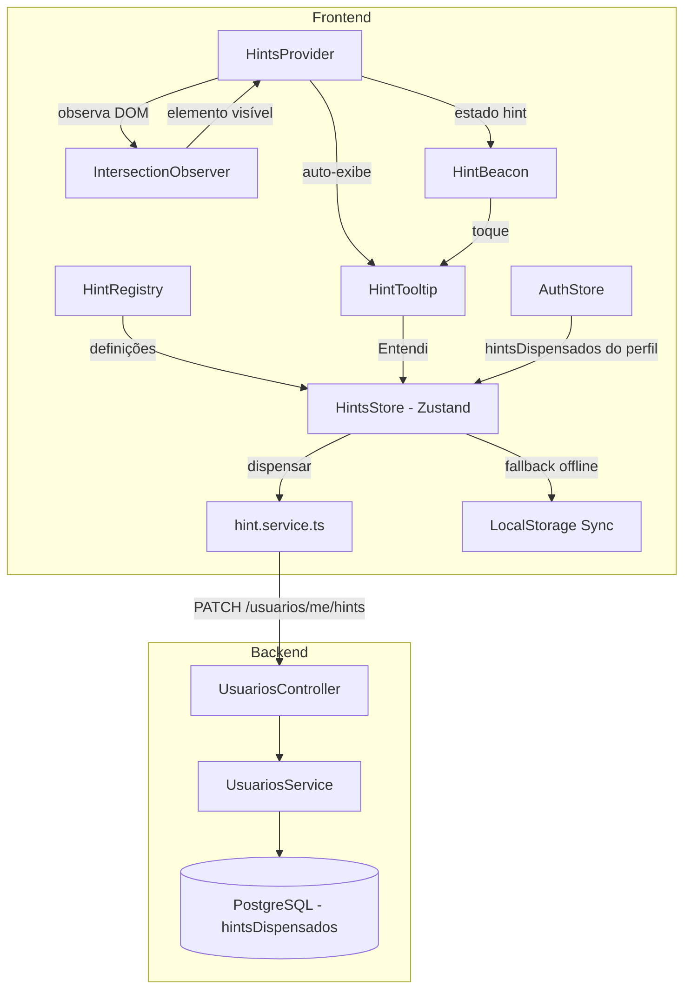
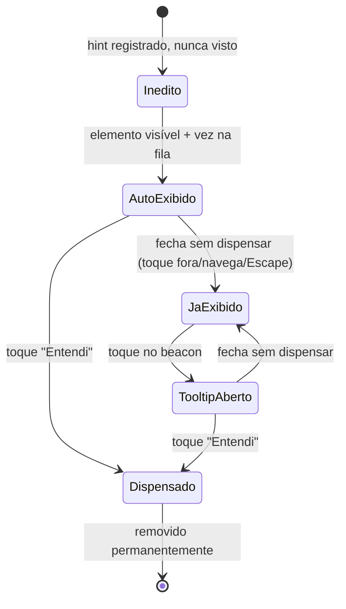

# Design Document — Hints Independentes

## Overview

Substituição do sistema de onboarding sequencial (react-joyride) por um modelo de **beacons com hints sob demanda**. Cada funcionalidade com dica disponível recebe uma bolinha pulsante (beacon) no canto superior direito do elemento-alvo. O usuário toca no beacon para ver o tooltip explicativo.

**Motivações:**
- O tour sequencial é intrusivo e bloqueia a UI
- Funcionalidades condicionais (ex: alerta de jogos atrasados) podem aparecer dias após o cadastro — tours não cobrem esse caso
- Beacons independentes permitem onboarding progressivo e contextual

**Abordagem:**
- IntersectionObserver detecta elementos-alvo visíveis no viewport
- Hints inéditos são auto-exibidos sequencialmente (um por vez, 500ms entre eles)
- Após auto-exibição, se não dispensado, o hint vira beacon (bolinha pulsante)
- Dispensar ("Entendi") persiste no backend e remove o beacon permanentemente
- Resiliência offline via localStorage (mesmo padrão do tour-sync atual)

## Architecture

### Diagrama de Fluxo de Dados



### Diagrama de Estados do Hint



### Princípios Arquiteturais

1. **Declarativo**: hints definidos em registry central, sem lógica em componentes de página
2. **Não-intrusivo**: nenhum overlay, nenhum bloqueio de interação
3. **Offline-first**: estado local é fonte de verdade, backend é persistência eventual
4. **Incremental**: migração gradual — não é necessário remover tours instantaneamente

## Components and Interfaces

### 1. HintRegistry (`src/lib/hint-registry.ts`)

Registro declarativo centralizado de todos os hints do sistema.

```typescript
export interface ConfiguracaoHint {
  hintId: string;              // formato: hint-{pagina}-{identificador}
  target: string;              // seletor CSS: [data-hint="identificador"]
  titulo: string;
  conteudo: string;
  placement: 'top' | 'bottom' | 'left' | 'right' | 'auto';
  prioridade: number;          // 1 (mais alta) a 5 (mais baixa)
  pagina: string;              // rota para filtragem
}

export const HINTS: ConfiguracaoHint[];

export function getHintsPorPagina(pathname: string): ConfiguracaoHint[];
```

### 2. HintsStore (`src/stores/hints.store.ts`)

Store Zustand que gerencia o ciclo de vida dos hints.

```typescript
type EstadoHint = 'inedito' | 'exibido' | 'dispensado';

interface EstadoHintsStore {
  // Estado
  hintsDispensados: Set<string>;
  hintsExibidos: Set<string>;       // já auto-exibidos mas não dispensados
  hintAtivo: string | null;         // tooltip atualmente visível
  filaAutoExibicao: string[];       // fila de hints inéditos aguardando vez

  // Ações
  inicializar: (dispensadosDoBackend: string[]) => void;
  dispensarHint: (hintId: string) => void;
  marcarComoExibido: (hintId: string) => void;
  abrirHint: (hintId: string) => void;
  fecharHint: () => void;
  enfileirar: (hintId: string) => void;
  desenfileirar: () => string | null;
  resetarTodos: () => Promise<void>;
  obterEstado: (hintId: string) => EstadoHint;

  // Sync
  sincronizarPendentes: () => Promise<void>;
}
```

### 3. HintsProvider (`src/components/hints/hints-provider.tsx`)

Componente client que orquestra a observação de elementos e renderização de beacons/tooltips.

```typescript
interface PropsHintsProvider {
  children: React.ReactNode;
}

// Responsabilidades:
// - Filtra hints por pathname atual
// - Cria IntersectionObserver para cada data-hint na página
// - Gerencia fila de auto-exibição (sequencial, 500ms intervalo)
// - Renderiza HintBeacon em elementos com hint não dispensado
// - Renderiza HintTooltip quando hint está ativo
```

### 4. HintBeacon (`src/components/hints/hint-beacon.tsx`)

Bolinha pulsante posicionada no canto superior direito do elemento-alvo.

```typescript
interface PropsHintBeacon {
  hintId: string;
  elementoAlvo: HTMLElement;
}

// Visual:
// - 8px de diâmetro, cor primária (#16a34a)
// - Animação pulse (scale 1→1.4 em loop)
// - Área de toque 44x44px (padding invisível)
// - Posição absolute no canto superior direito
```

### 5. HintTooltip (`src/components/hints/hint-tooltip.tsx`)

Tooltip informativo com título, descrição e botão "Entendi".

```typescript
interface PropsHintTooltip {
  hintId: string;
  titulo: string;
  conteudo: string;
  placement: 'top' | 'bottom' | 'left' | 'right' | 'auto';
  elementoAlvo: HTMLElement;
  aoDispensar: () => void;
  aoFechar: () => void;
}

// Visual:
// - max-width 280px
// - Glassmorphism: bg-[#0f1a2e]/95 backdrop-blur-2xl border-white/[0.12]
// - role="tooltip", dismissível via Escape
// - Recalcula posição se transborda viewport
```

### 6. HintService (`src/services/hint.service.ts`)

```typescript
export async function dispensarHint(hintId: string): Promise<void>;
export async function resetarHints(): Promise<void>;
```

### 7. HintSync (`src/lib/hint-sync.ts`)

Mecanismo offline-first idêntico ao `tour-sync.ts` existente.

```typescript
export const HINT_STORAGE_KEY = 'hints-pendentes';
export function salvarHintPendente(hintId: string): void;
export async function sincronizarHintsPendentes(): Promise<void>;
```

## Data Models

### Frontend — Tipo Usuario (alteração)

```typescript
// src/types/usuario.types.ts — adicionar campo
interface Usuario {
  // ... campos existentes
  toursCompletos: string[];       // manter durante migração
  hintsDispensados: string[];     // NOVO
  toastDescobrilidadeVisto: boolean; // NOVO — flag do toast inicial
}
```

### Frontend — Hint State (localStorage)

```typescript
// Chave: 'hints-exibidos'
// Valor: string[] — hintIds que já foram auto-exibidos mas não dispensados

// Chave: 'hints-pendentes'  
// Valor: string[] — hintIds dispensados offline aguardando sync

// Chave: 'toast-descobrilidade-visto'
// Valor: 'true' | ausente
```

### Backend — Schema Prisma (alteração no model Usuario)

```prisma
model Usuario {
  // ... campos existentes
  toursCompletos       String[]   @default([])
  hintsDispensados     String[]   @default([])
  toastDescobrilidadeVisto Boolean @default(false) @map("toast_descobrilidade_visto")
}
```

### Backend — DTOs

```typescript
// dto/dispensar-hint.dto.ts
export class DispensarHintDto {
  @IsString({ message: 'hintId deve ser uma string' })
  @IsNotEmpty({ message: 'hintId é obrigatório' })
  hintId: string;
}

// dto/resetar-hints.dto.ts — sem body (ação do usuário autenticado)
```

### Backend — Endpoints

| Método | Rota | Descrição |
|--------|------|-----------|
| PATCH | `/usuarios/me/hints` | Dispensar um hint (idempotente) |
| DELETE | `/usuarios/me/hints` | Resetar todos os hints |

### Backend — Migration de dados

Script de migração que converte `toursCompletos` em `hintsDispensados`:

```sql
-- Para cada tourId completo, marcar todos os hintIds mapeados como dispensados
-- Mapeamento definido no HintRegistry: tourId → hintIds[]
```

A migração será executada como data migration (script Prisma) no deploy, não como schema migration.

## Correctness Properties

*A property is a characteristic or behavior that should hold true across all valid executions of a system — essentially, a formal statement about what the system should do. Properties serve as the bridge between human-readable specifications and machine-verifiable correctness guarantees.*

### Property 1: Dispensar marca como dispensado

*For any* hintId válido, ao chamar `dispensarHint(hintId)`, o estado retornado por `obterEstado(hintId)` SHALL ser `'dispensado'`, e o hintId SHALL estar presente no Set `hintsDispensados`.

**Validates: Requirements 1.4, 3.2, 3.3**

### Property 2: Fechar sem dispensar marca como exibido

*For any* hintId que está no estado `'inedito'` ou com tooltip aberto, ao chamar `marcarComoExibido(hintId)`, o estado retornado por `obterEstado(hintId)` SHALL ser `'exibido'`, e o hintId SHALL estar no Set `hintsExibidos` mas NÃO no Set `hintsDispensados`.

**Validates: Requirements 1.5**

### Property 3: Fila de auto-exibição — invariante de exclusividade

*For any* conjunto de N hints inéditos cujos elementos ficam visíveis simultaneamente, o sistema SHALL manter no máximo 1 `hintAtivo` (tooltip auto-exibido) por vez em qualquer instante.

**Validates: Requirements 1.2**

### Property 4: Mapeamento estado → renderização

*For any* hintId, o comportamento de renderização SHALL seguir deterministicamente o estado:
- Se `obterEstado(hintId) === 'dispensado'` → nenhum beacon, nenhum tooltip
- Se `obterEstado(hintId) === 'exibido'` → beacon visível (sem auto-exibição)
- Se `obterEstado(hintId) === 'inedito'` → candidato a auto-exibição ou beacon temporário

**Validates: Requirements 2.1, 2.6, 3.3**

### Property 5: Toque no beacon abre tooltip correto

*For any* hintId no estado `'exibido'` com beacon visível, ao acionar `abrirHint(hintId)`, o `hintAtivo` do store SHALL ser igual ao hintId acionado.

**Validates: Requirements 2.5**

### Property 6: Idempotência do backend

*For any* hintId, ao chamar `marcarHintDispensado(usuarioId, hintId)` duas ou mais vezes, o array `hintsDispensados` do usuário SHALL conter o hintId exatamente uma vez (sem duplicatas).

**Validates: Requirements 4.3**

### Property 7: Resiliência offline — round trip de sincronização

*For any* conjunto de hintIds pendentes em localStorage:
- Se a API responde com sucesso para um hintId, esse hintId SHALL ser removido da lista de pendentes
- Se a API falha para um hintId, esse hintId SHALL permanecer na lista de pendentes

**Validates: Requirements 5.1, 5.3, 5.4**

### Property 8: Validade estrutural do registry

*For any* entrada no `HINTS` array, a entrada SHALL possuir todos os campos obrigatórios (`hintId`, `target`, `titulo`, `conteudo`, `placement`, `prioridade`, `pagina`) com valores não-vazios e `prioridade` entre 1 e 5.

**Validates: Requirements 6.1**

### Property 9: Filtragem por página

*For any* pathname, `getHintsPorPagina(pathname)` SHALL retornar apenas hints cujo campo `pagina` corresponde ao pathname fornecido, e SHALL não omitir nenhum hint que deveria corresponder.

**Validates: Requirements 6.2**

### Property 10: Ordenação por prioridade na fila

*For any* conjunto de hints inéditos enfileirados para auto-exibição, a ordem da fila SHALL respeitar o campo `prioridade` (menor número = exibido primeiro). Hints com mesma prioridade mantêm ordem de detecção.

**Validates: Requirements 6.4**

### Property 11: Reset limpa todos os dispensados

*For any* conjunto de hintIds previamente dispensados, ao chamar `resetarTodos()`, todos os hintIds SHALL retornar ao estado `'inedito'` — `hintsDispensados` e `hintsExibidos` SHALL estar vazios.

**Validates: Requirements 7.1**

### Property 12: Tooltip renderiza todos os campos configurados

*For any* ConfiguracaoHint com `titulo` e `conteudo` não-vazios, o HintTooltip renderizado SHALL conter o texto do `titulo`, o texto do `conteudo`, e um botão com texto "Entendi".

**Validates: Requirements 8.1**

### Property 13: Tooltip não transborda viewport

*For any* posição de elemento-alvo e placement configurado, a posição calculada do tooltip SHALL manter o tooltip inteiramente dentro dos limites do viewport (min 320px de largura).

**Validates: Requirements 8.3**

### Property 14: Toast exibido no máximo uma vez

*For any* usuário com `toastDescobrilidadeVisto === true`, o toast de descobrilidade SHALL nunca ser renderizado, independentemente do estado de hints ou tours.

**Validates: Requirements 9.3**

### Property 15: Migração converte tours em hints

*For any* usuário com `toursCompletos` contendo tourIds válidos, a função de migração SHALL adicionar todos os hintIds mapeados (conforme tabela tourId → hintIds[]) ao array `hintsDispensados`, sem duplicatas e sem perder hintIds já existentes.

**Validates: Requirements 10.2**

## Error Handling

### Frontend

| Cenário | Comportamento |
|---------|--------------|
| API de dispensar hint falha (network/5xx) | Salvar hintId em localStorage pendentes. UI marca como dispensado localmente (otimista). Log no console. |
| API de resetar hints falha | Exibir toast de erro "Não foi possível resetar. Tente novamente." Não limpar estado local. |
| IntersectionObserver não suportado | Fallback: não auto-exibir, renderizar beacons para todos os hints não dispensados da página. |
| Elemento-alvo não encontrado no DOM | Ignorar silenciosamente. Não criar beacon. Tentar novamente via MutationObserver se elemento aparecer depois. |
| localStorage indisponível (Safari modo privado) | Graceful degradation: dispensar funciona normalmente mas sem persistência offline. Hints exibidos resetam entre sessões. |
| Tooltip posicionamento impossível (elemento no edge do viewport) | Recalcular para placement oposto. Se impossível, usar 'bottom' como fallback. |
| Hint com target inválido (seletor CSS mal formado) | Ignorar hint, logar warning em dev. Não quebrar renderização dos demais hints. |

### Backend

| Cenário | Comportamento |
|---------|--------------|
| hintId já existe em hintsDispensados | Retornar 200 OK sem modificar (idempotente). |
| hintId vazio ou null | Retornar 400 com mensagem de validação. |
| Usuário não encontrado | Retornar 404 (padrão do UsuariosService). |
| Erro de banco ao atualizar | Retornar 500. Frontend salva em pendentes locais. |
| Reset quando array já está vazio | Retornar 200 OK (idempotente). |

## Testing Strategy

### Abordagem Dual: Unit Tests + Property Tests

O sistema de hints possui lógica de estado pura (store, registry, sync) ideal para property-based testing, complementada por testes de exemplo para integração e UI.

### Property-Based Tests (fast-check)

**Biblioteca:** fast-check (já instalada no projeto — ver `package.json`)
**Iterações mínimas:** 100 por propriedade
**Tag:** Cada teste referencia a propriedade do design: `// Feature: hints-independentes, Property N: {título}`

**Propriedades a implementar:**

| # | Propriedade | Módulo testado |
|---|------------|----------------|
| 1 | Dispensar marca como dispensado | hints.store |
| 2 | Fechar sem dispensar marca como exibido | hints.store |
| 3 | Fila — max 1 ativo por vez | hints.store (filaAutoExibicao) |
| 4 | Estado → renderização determinística | hints.store + HintsProvider |
| 5 | Toque beacon abre tooltip correto | hints.store |
| 6 | Idempotência backend | UsuariosService |
| 7 | Sync offline round-trip | hint-sync |
| 8 | Registry schema válido | hint-registry |
| 9 | Filtragem por página | hint-registry |
| 10 | Ordenação por prioridade | hints.store (fila) |
| 11 | Reset limpa todos | hints.store |
| 12 | Tooltip renderiza campos | HintTooltip |
| 13 | Tooltip dentro do viewport | posicionamento |
| 14 | Toast no máximo uma vez | flag check |
| 15 | Migração tours → hints | migration script |

### Unit Tests (Vitest + React Testing Library)

**Cenários de exemplo:**

- HintBeacon: renderiza com classes corretas, área de toque 44x44px, animação pulse
- HintTooltip: role="tooltip", Escape dismisses, botão "Entendi" chama callback
- HintsProvider: auto-exibe hint inédito quando elemento fica visível
- HintService: chamada HTTP correta para dispensar e resetar
- Integração AuthStore: hintsDispensados carregados no login
- Toast de descobrilidade: aparece para novo usuário, não aparece se flag true
- Botão "Resetar dicas" na página Minha Conta

### Integration Tests

- Backend endpoint `PATCH /usuarios/me/hints`: idempotência, validação
- Backend endpoint `DELETE /usuarios/me/hints`: limpa array
- Migration script: conversão correta de toursCompletos → hintsDispensados
- Sincronização de pendentes no login (hint-sync + API mock)

### Testes E2E (Playwright — se aplicável)

- Fluxo completo: novo usuário → toast aparece → hint auto-exibido → dispensar → beacon desaparece
- Reset: dispensar hints → resetar → beacons reaparecem
- Offline: dispensar com rede off → verificar localStorage → reconectar → sincroniza

