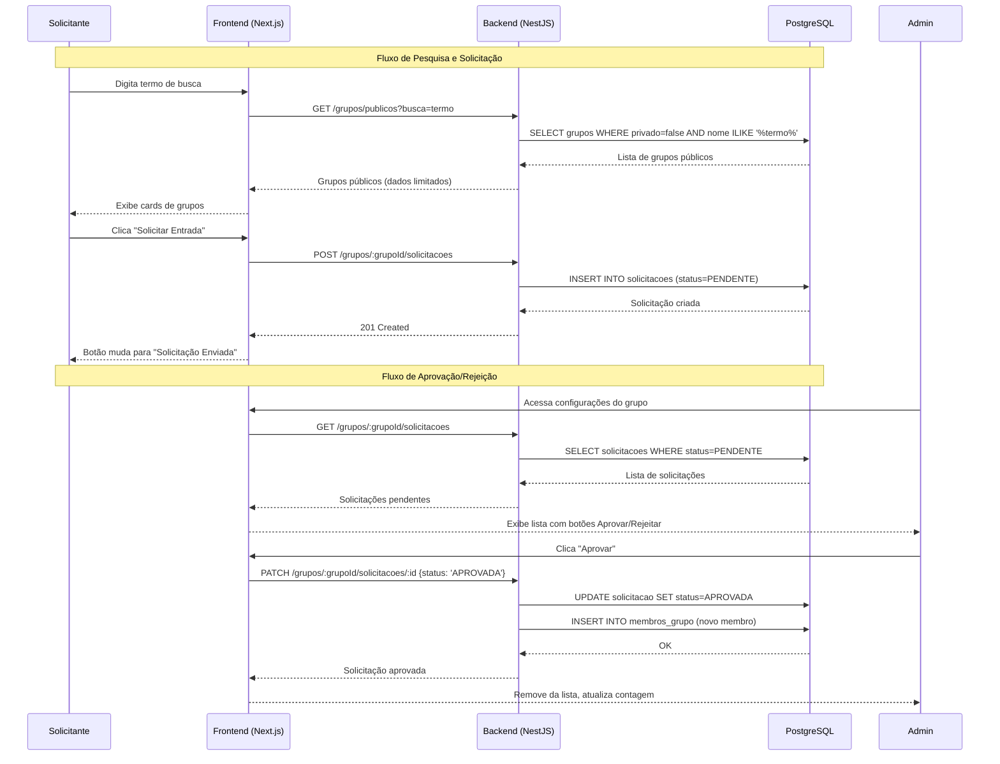
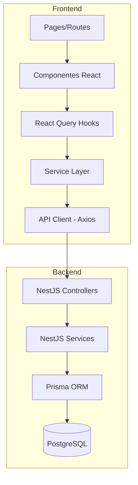

# Design Document: Solicitação de Entrada em Grupo

## Overview

Esta funcionalidade adiciona um fluxo de solicitação de entrada em grupos públicos com aprovação do administrador. Atualmente, a única forma de entrar em um grupo é via código de convite. Com esta feature, usuários poderão pesquisar grupos públicos, enviar solicitações de entrada e acompanhar o status. Administradores poderão aprovar ou rejeitar solicitações na página de configurações do grupo.

### Escopo

**Backend (NestJS + Prisma):**
- Nova tabela `solicitacoes` no banco de dados
- 5 novos endpoints REST
- Ajuste no endpoint existente `GET /grupos/:grupoId`

**Frontend (Next.js + React Query):**
- Novos tipos TypeScript
- Novas funções de serviço
- Seção de pesquisa de grupos públicos na página `/grupos`
- Bloqueio de acesso a detalhes do grupo para não-membros (preview + botão "Solicitar Entrada")
- Seção "Solicitações Pendentes" na página de configurações do grupo
- Seção "Minhas Solicitações" na página de grupos

## Architecture

### Diagrama de Fluxo



### Camadas da Aplicação



## Components and Interfaces

### Backend

#### Controller: `SolicitacoesController`

```typescript
@Controller()
export class SolicitacoesController {
  // Pesquisar grupos públicos (não requer ser membro)
  @Get('/grupos/publicos')
  buscarGruposPublicos(@Query('busca') busca: string, @Req() req): Promise<GrupoPublicoDto[]>

  // Enviar solicitação de entrada
  @Post('/grupos/:grupoId/solicitacoes')
  criarSolicitacao(@Param('grupoId') grupoId: string, @Req() req): Promise<SolicitacaoDto>

  // Listar solicitações pendentes (admin only)
  @Get('/grupos/:grupoId/solicitacoes')
  listarSolicitacoes(@Param('grupoId') grupoId: string, @Req() req): Promise<SolicitacaoDto[]>

  // Aprovar ou rejeitar solicitação (admin only)
  @Patch('/grupos/:grupoId/solicitacoes/:solicitacaoId')
  responderSolicitacao(
    @Param('grupoId') grupoId: string,
    @Param('solicitacaoId') solicitacaoId: string,
    @Body() body: { status: 'APROVADA' | 'REJEITADA' },
    @Req() req
  ): Promise<SolicitacaoDto>

  // Listar minhas solicitações
  @Get('/solicitacoes/minhas')
  listarMinhasSolicitacoes(@Req() req): Promise<SolicitacaoComGrupoDto[]>
}
```

#### Service: `SolicitacoesService`

```typescript
@Injectable()
export class SolicitacoesService {
  buscarGruposPublicos(busca: string, usuarioId: string): Promise<GrupoPublicoDto[]>
  criarSolicitacao(grupoId: string, usuarioId: string): Promise<Solicitacao>
  listarSolicitacoesPendentes(grupoId: string): Promise<Solicitacao[]>
  responderSolicitacao(solicitacaoId: string, status: StatusSolicitacao, adminId: string): Promise<Solicitacao>
  listarMinhasSolicitacoes(usuarioId: string): Promise<Solicitacao[]>
}
```

#### Guards e Validações (Backend)

- `@UseGuards(AuthGuard)` em todos os endpoints
- Verificação de role ADMIN para `GET /grupos/:grupoId/solicitacoes` e `PATCH`
- Validação: não permitir solicitação se já é membro
- Validação: não permitir solicitação se já existe uma PENDENTE para o mesmo grupo
- Validação: verificar `maxParticipantes` antes de aprovar
- Validação: grupo deve ser público (privado=false) para receber solicitações

### Frontend

#### Novos Tipos (`src/types/solicitacao.types.ts`)

```typescript
export type StatusSolicitacao = 'PENDENTE' | 'APROVADA' | 'REJEITADA';

export interface Solicitacao {
  id: string;
  usuarioId: string;
  grupoId: string;
  status: StatusSolicitacao;
  dataCriacao: string;
  dataResposta: string | null;
  usuario?: {
    id: string;
    nome: string;
    email: string;
  };
}

export interface SolicitacaoComGrupo extends Solicitacao {
  grupo: {
    id: string;
    nome: string;
    totalParticipantes: number;
  };
}

export interface GrupoPublico {
  id: string;
  nome: string;
  totalParticipantes: number;
  maxParticipantes: number;
  privado: false;
  minhaSolicitacao?: {
    id: string;
    status: StatusSolicitacao;
  } | null;
}
```

#### Novo Service (`src/services/solicitacao.service.ts`)

```typescript
export async function buscarGruposPublicos(busca: string): Promise<GrupoPublico[]>
export async function criarSolicitacao(grupoId: string): Promise<Solicitacao>
export async function listarSolicitacoesPendentes(grupoId: string): Promise<Solicitacao[]>
export async function responderSolicitacao(
  grupoId: string,
  solicitacaoId: string,
  status: 'APROVADA' | 'REJEITADA'
): Promise<Solicitacao>
export async function listarMinhasSolicitacoes(): Promise<SolicitacaoComGrupo[]>
```

#### Componentes Novos

| Componente | Localização | Responsabilidade |
|---|---|---|
| `SecaoPesquisaGrupos` | `src/components/grupo/secao-pesquisa-grupos.tsx` | Input de busca + lista de resultados |
| `CardGrupoPesquisa` | `src/components/grupo/card-grupo-pesquisa.tsx` | Card de grupo público com botão de solicitar |
| `SecaoSolicitacoesPendentes` | `src/components/grupo/secao-solicitacoes-pendentes.tsx` | Lista de solicitações para o admin |
| `CardSolicitacao` | `src/components/grupo/card-solicitacao.tsx` | Card individual de solicitação com ações |
| `SecaoMinhasSolicitacoes` | `src/components/grupo/secao-minhas-solicitacoes.tsx` | Lista de solicitações do usuário |
| `PreviewGrupoNaoMembro` | `src/components/grupo/preview-grupo-nao-membro.tsx` | Preview do grupo + botão solicitar entrada |

#### Páginas Modificadas

| Página | Modificação |
|---|---|
| `/grupos` (page.tsx) | Adicionar `SecaoPesquisaGrupos` abaixo do header |
| `/grupos/[grupoId]` (page.tsx) | Verificar se é membro; se não, renderizar `PreviewGrupoNaoMembro` |
| `/grupos/[grupoId]/configuracoes` (page.tsx) | Adicionar `SecaoSolicitacoesPendentes` antes da seção de membros |

#### React Query Keys

```typescript
// Pesquisa de grupos públicos
['grupos-publicos', busca]

// Solicitações pendentes de um grupo (admin)
['grupo', grupoId, 'solicitacoes']

// Minhas solicitações
['minhas-solicitacoes']
```

#### Fluxo de Estado (React Query + Invalidação)

- Ao criar solicitação: invalidar `['grupos-publicos', busca]` e `['minhas-solicitacoes']`
- Ao aprovar/rejeitar: invalidar `['grupo', grupoId, 'solicitacoes']` e `['grupo', grupoId, 'membros']`
- Ao aprovar: invalidar também `['grupos']` (lista de grupos do solicitante)

## Data Models

### Tabela `solicitacoes` (Prisma Schema)

```prisma
model Solicitacao {
  id           String              @id @default(uuid())
  usuarioId    String
  grupoId      String
  status       StatusSolicitacao   @default(PENDENTE)
  dataCriacao  DateTime            @default(now())
  dataResposta DateTime?

  usuario      Usuario             @relation(fields: [usuarioId], references: [id], onDelete: Cascade)
  grupo        Grupo               @relation(fields: [grupoId], references: [id], onDelete: Cascade)

  @@unique([usuarioId, grupoId, status], name: "solicitacao_unica_pendente")
  @@index([grupoId, status])
  @@index([usuarioId])
  @@map("solicitacoes")
}

enum StatusSolicitacao {
  PENDENTE
  APROVADA
  REJEITADA
}
```

### Constraint de Unicidade

A constraint `@@unique([usuarioId, grupoId, status])` garante que não existam duas solicitações com o mesmo status para o mesmo par usuário/grupo. Porém, como queremos permitir reenvio após rejeição, a lógica de unicidade será tratada no service:
- Antes de criar: verificar se já existe uma solicitação PENDENTE para o par (usuarioId, grupoId)
- Se existir PENDENTE: retornar erro 409 (Conflict)
- Se existir REJEITADA: permitir criar nova (a anterior permanece como histórico)

**Alternativa escolhida:** Remover a constraint unique composta e usar validação no service, pois a regra de negócio permite múltiplas solicitações rejeitadas no histórico.

```prisma
model Solicitacao {
  id           String              @id @default(uuid())
  usuarioId    String
  grupoId      String
  status       StatusSolicitacao   @default(PENDENTE)
  dataCriacao  DateTime            @default(now())
  dataResposta DateTime?

  usuario      Usuario             @relation(fields: [usuarioId], references: [id], onDelete: Cascade)
  grupo        Grupo               @relation(fields: [grupoId], references: [id], onDelete: Cascade)

  @@index([grupoId, status])
  @@index([usuarioId])
  @@map("solicitacoes")
}
```

### Ajuste no Endpoint `GET /grupos/:grupoId`

O endpoint existente será ajustado para verificar se o usuário autenticado é membro do grupo:
- **Se é membro:** retorna dados completos (comportamento atual)
- **Se NÃO é membro:** retorna dados limitados (nome, privado, totalParticipantes, maxParticipantes) + campo `ehMembro: false`

```typescript
interface GrupoDetalheLimitado {
  id: string;
  nome: string;
  privado: boolean;
  totalParticipantes: number;
  maxParticipantes: number;
  ehMembro: false;
  minhaSolicitacao?: {
    id: string;
    status: StatusSolicitacao;
  } | null;
}
```

### Endpoints - Detalhamento

#### `GET /grupos/publicos?busca=termo`

| Campo | Detalhe |
|---|---|
| Auth | Requer token JWT |
| Query Params | `busca` (string, min 3 caracteres) |
| Response 200 | `GrupoPublico[]` |
| Filtros | `privado = false`, `nome ILIKE '%termo%'`, exclui grupos onde o usuário já é membro |
| Ordenação | Por nome (ASC) |
| Limite | 20 resultados |

#### `POST /grupos/:grupoId/solicitacoes`

| Campo | Detalhe |
|---|---|
| Auth | Requer token JWT |
| Validações | Grupo deve ser público; usuário não pode ser membro; não pode ter solicitação PENDENTE |
| Response 201 | `Solicitacao` criada |
| Response 409 | Já existe solicitação pendente |
| Response 400 | Grupo privado ou usuário já é membro |

#### `GET /grupos/:grupoId/solicitacoes`

| Campo | Detalhe |
|---|---|
| Auth | Requer token JWT + role ADMIN no grupo |
| Response 200 | `Solicitacao[]` (apenas status PENDENTE, com dados do usuário) |
| Ordenação | Por dataCriacao (ASC - mais antigas primeiro) |

#### `PATCH /grupos/:grupoId/solicitacoes/:solicitacaoId`

| Campo | Detalhe |
|---|---|
| Auth | Requer token JWT + role ADMIN no grupo |
| Body | `{ status: 'APROVADA' \| 'REJEITADA' }` |
| Response 200 | `Solicitacao` atualizada |
| Side Effect (APROVADA) | Cria registro em `membros_grupo` com role MEMBER |
| Validação (APROVADA) | Verifica `maxParticipantes` antes de aprovar |
| Response 400 | Grupo cheio (ao aprovar) |

#### `GET /solicitacoes/minhas`

| Campo | Detalhe |
|---|---|
| Auth | Requer token JWT |
| Response 200 | `SolicitacaoComGrupo[]` (todas as solicitações do usuário, com dados do grupo) |
| Ordenação | Por dataCriacao (DESC - mais recentes primeiro) |


## Correctness Properties

*A property is a characteristic or behavior that should hold true across all valid executions of a system — essentially, a formal statement about what the system should do. Properties serve as the bridge between human-readable specifications and machine-verifiable correctness guarantees.*

### Property 1: Search filtering returns only matching results

*For any* list of groups and any search term with 3+ characters, the search function SHALL return only groups whose name contains the search term (case-insensitive), and all such matching groups SHALL be included in the results.

**Validates: Requirements 1.2**

### Property 2: GrupoPublico card displays all required information

*For any* valid GrupoPublico object, the rendered CardGrupoPesquisa SHALL contain the group name, the participant count (totalParticipantes), and a visual indicator that the group is public.

**Validates: Requirements 1.3**

### Property 3: Non-member view hides internal group details

*For any* group where the user is not a member (ehMembro=false), the rendered view SHALL NOT display ranking data, activity feed, member list, or invite code.

**Validates: Requirements 1.4**

### Property 4: Button state is determined by solicitacao status

*For any* GrupoPublico card:
- If `minhaSolicitacao` is null, the button SHALL show "Solicitar Entrada" and be enabled
- If `minhaSolicitacao.status` is PENDENTE, the button SHALL show "Solicitação Enviada" and be disabled
- If `minhaSolicitacao.status` is REJEITADA, the button SHALL show "Solicitar Novamente" and be enabled

**Validates: Requirements 2.1, 2.4, 2.6, 7.3**

### Property 5: Pending solicitacoes count matches data length

*For any* list of pending solicitacoes, the displayed count badge SHALL equal the length of the solicitacoes array.

**Validates: Requirements 3.1**

### Property 6: Solicitacao pendente card displays required user information

*For any* valid Solicitacao with associated usuario data, the rendered card SHALL contain the solicitante's name, email, and the formatted creation date.

**Validates: Requirements 3.3**

### Property 7: Minhas solicitações displays complete information per item

*For any* valid SolicitacaoComGrupo, the rendered item SHALL contain the group name, the creation date, and the current status label (PENDENTE, APROVADA, or REJEITADA).

**Validates: Requirements 7.1, 7.2**

## Error Handling

### Backend Errors

| Cenário | HTTP Status | Mensagem |
|---|---|---|
| Busca com menos de 3 caracteres | 400 | "Termo de busca deve ter pelo menos 3 caracteres" |
| Solicitar entrada em grupo privado | 400 | "Não é possível solicitar entrada em grupo privado" |
| Usuário já é membro do grupo | 400 | "Você já é membro deste grupo" |
| Solicitação pendente já existe | 409 | "Você já possui uma solicitação pendente para este grupo" |
| Grupo não encontrado | 404 | "Grupo não encontrado" |
| Solicitação não encontrada | 404 | "Solicitação não encontrada" |
| Grupo cheio (ao aprovar) | 400 | "O grupo atingiu o limite máximo de participantes" |
| Usuário não é admin do grupo | 403 | "Apenas administradores podem gerenciar solicitações" |
| Token inválido/expirado | 401 | Handled by existing refresh interceptor |

### Frontend Error Handling

- Erros de rede: exibir mensagem genérica "Erro de conexão" com botão de retry
- Erros 4xx: exibir mensagem retornada pela API usando o padrão `ErroApi` existente
- Loading states: usar `isLoading` / `isPending` do React Query para feedback visual
- Optimistic updates: NÃO usar para aprovação/rejeição (aguardar confirmação da API)

### Validação Frontend (Zod)

```typescript
// Schema de busca
export const schemaBuscaGrupos = z.object({
  busca: z.string().min(3, 'Digite pelo menos 3 caracteres para pesquisar'),
});

// Schema de resposta de solicitação (admin)
export const schemaRespostaSolicitacao = z.object({
  status: z.enum(['APROVADA', 'REJEITADA']),
});
```

## Testing Strategy

### Abordagem Dual

Esta feature utiliza uma combinação de:
- **Testes unitários (example-based):** para cenários específicos, edge cases, e interações de UI
- **Testes de propriedade (property-based):** para validar propriedades universais da lógica de filtragem e renderização

### Property-Based Testing

**Biblioteca:** `fast-check` (já instalada no projeto)
**Framework:** `vitest` (já configurado)
**Iterações mínimas:** 100 por propriedade

Cada teste de propriedade deve ser tagueado com:
```
// Feature: solicitacao-entrada-grupo, Property {N}: {título}
```

**Propriedades a implementar:**
1. Filtragem de busca retorna apenas resultados correspondentes
2. CardGrupoPesquisa exibe informações obrigatórias
3. View de não-membro oculta detalhes internos
4. Estado do botão determinado pelo status da solicitação
5. Contagem de pendentes corresponde ao tamanho do array
6. Card de solicitação pendente exibe dados do usuário
7. Minhas solicitações exibe informações completas por item

### Testes Unitários (Example-Based)

**Cenários prioritários:**
- Renderização da seção de pesquisa na página de grupos
- Estado vazio da pesquisa (nenhum resultado)
- Clique no botão "Solicitar Entrada" dispara API call
- Feedback de sucesso após envio de solicitação
- Tratamento de erros (rede, 409, 400)
- Modal de confirmação ao rejeitar
- Remoção do item da lista após aprovação/rejeição
- Estado vazio de solicitações pendentes
- Clique em "Solicitar Novamente" cria nova solicitação

### Testes de Integração

- Fluxo completo: pesquisar → solicitar → verificar status
- Fluxo admin: visualizar pendentes → aprovar → verificar membro adicionado
- Invalidação de cache após aprovação (grupo aparece em "Meus Grupos")

### Estrutura de Arquivos de Teste

```
src/
├── components/grupo/
│   ├── __tests__/
│   │   ├── card-grupo-pesquisa.test.tsx
│   │   ├── card-grupo-pesquisa.property.test.tsx
│   │   ├── secao-pesquisa-grupos.test.tsx
│   │   ├── secao-solicitacoes-pendentes.test.tsx
│   │   ├── secao-solicitacoes-pendentes.property.test.tsx
│   │   ├── secao-minhas-solicitacoes.test.tsx
│   │   └── secao-minhas-solicitacoes.property.test.tsx
│   └── ...
├── services/
│   ├── __tests__/
│   │   └── solicitacao.service.test.ts
│   └── ...
└── ...
```
