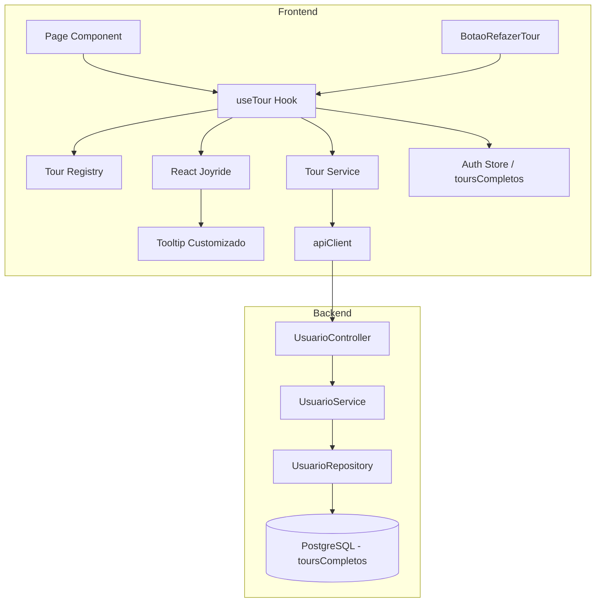

# Design Document — Tour de Onboarding

## Overview

Sistema de tours interativos contextuais por página para guiar novos usuários pelas funcionalidades do app de bolão. Utiliza a biblioteca `react-joyride` para renderizar steps com spotlight e tooltips customizados, um hook reutilizável (`useTour`) para gerenciar o ciclo de vida de cada tour, e persistência de progresso no backend via campo `toursCompletos` no model Usuario.

**Decisões-chave:**
- `react-joyride` como engine de tour (spotlight, overlay, posicionamento automático de tooltip)
- Hook customizado `useTour` encapsula toda a lógica de estado e callbacks
- Registro centralizado de tours (`tour-registry.ts`) com steps por página
- Atributos `data-tour` nos elementos-alvo para referência estável
- Persistência otimista com fallback local em caso de falha de rede
- Tooltip customizado com glassmorphism integrado ao design system
- 3 tours contextuais: Home, Grupo, Palpites (ranking integrado no tour-grupo, não há página separada)
- Botão de refazer posicionado no header de cada página (ao lado do SinoNotificacoes), não num layout global

## Architecture



**Fluxo principal:**
1. Página renderiza → `useTour` consulta `toursCompletos` do auth store
2. Se tour ID não está em `toursCompletos` → ativa tour automaticamente
3. React Joyride renderiza overlay + tooltip customizado
4. Ao concluir/pular → hook chama `tourService.marcarCompleto(tourId)`
5. Backend adiciona ID ao array `toursCompletos` do usuário
6. Auth store atualiza localmente para evitar re-exibição

## Components and Interfaces

### Frontend Components

```
src/
├── components/
│   └── tour/
│       ├── tooltip-tour.tsx          # Tooltip customizado (glassmorphism)
│       ├── botao-refazer-tour.tsx    # Botão (?) no header
│       └── tour-provider.tsx         # Wrapper com Joyride + useTour
├── hooks/
│   └── use-tour.ts                   # Hook principal
├── lib/
│   └── tour-registry.ts             # Registro de tours e steps por página
├── services/
│   └── tour.service.ts              # Chamadas à API de tours
└── types/
    └── tour.types.ts                 # Tipos do tour
```

### Hook `useTour`

```typescript
interface UseTourOptions {
  tourId: TourId;
  steps: StepTour[];
}

interface UseTourRetorno {
  tourAtivo: boolean;
  steps: StepTour[];
  stepAtual: number;
  aguardando: boolean;
  handleCallback: (data: CallBackProps) => void;
  iniciarTour: () => void;
  avancar: () => void;
  retroceder: () => void;
  encerrar: () => void;
}
```

**Lógica interna:**
- Consulta `toursCompletos` do auth store (via `useAuth`)
- Enquanto `toursCompletos === undefined` (loading) → `aguardando=true`, `tourAtivo=false`
- Se `tourId` não está em `toursCompletos` → `tourAtivo=true` automaticamente
- `handleCallback` escuta eventos `STATUS.FINISHED` e `STATUS.SKIPPED` do react-joyride
- Ao finalizar → `encerrar()` + `tourService.marcarCompleto(tourId)` + atualiza store local

### Tooltip Customizado (`TooltipTour`)

```typescript
interface PropsTooltipTour {
  step: Step;
  index: number;
  size: number;
  isLastStep: boolean;
  backProps: object;
  primaryProps: object;
  skipProps: object;
  tooltipProps: object;
}
```

Renderiza:
- Container com glassmorphism
- Título do step (`font-semibold text-texto`)
- Corpo do step (`text-sm text-texto/80`)
- Indicador de progresso: `"{index + 1} de {size}"`
- Botão "Pular" (ghost, sempre visível)
- Botão "Anterior" (outline, visível quando `index > 0`)
- Botão "Próximo" ou "Concluir" (primário, baseado em `isLastStep`)

### Botão Refazer Tour (`BotaoRefazerTour`)

```typescript
interface PropsBotaoRefazerTour {
  toursDisponiveis: TourId[];
  onIniciarTour: (tourId: TourId) => void;
}
```

- Renderiza ícone `HelpCircle` (lucide) no header de cada página com tour
- Posicionado ao lado do `SinoNotificacoes` (ou equivalente) nas páginas Home, Grupo e Palpites
- Se `toursDisponiveis.length === 0` → desabilitado com `opacity-50 cursor-not-allowed`
- Se `toursDisponiveis.length === 1` → click inicia tour diretamente
- Se `toursDisponiveis.length > 1` → click abre dropdown com lista de tours
- Atributo `data-tour="botao-refazer-tour"` para ser target do último step

### Tour Registry (`tour-registry.ts`)

```typescript
type TourId = 'tour-home' | 'tour-grupo' | 'tour-palpites';

interface StepTour {
  target: string;        // seletor data-tour: '[data-tour="nome"]'
  titulo: string;
  conteudo: string;
  placement?: Placement;
}

interface ConfiguracaoTour {
  id: TourId;
  nome: string;          // nome exibido no menu de refazer
  pagina: string;        // pathname pattern (ex: '/inicio', '/grupos/[grupoId]')
  steps: StepTour[];
}
```

**Tours configurados:**

| Tour ID | Página | Steps |
|---------|--------|-------|
| `tour-home` | `/inicio` | Boas-vindas, Card próximos jogos, Lista de grupos, Card ranking, Botão refazer |
| `tour-grupo` | `/grupos/[grupoId]` | Convidar amigos, Jogos da rodada, Ranking do grupo, Navegação rodadas, Botão refazer |
| `tour-palpites` | `/palpites` | Escolher placar, Palpite dobrado, Salvar palpites, Botão refazer |

Todos os tours terminam com step final apontando para `[data-tour="botao-refazer-tour"]`.

### Tour Service (`tour.service.ts`)

```typescript
export async function marcarTourCompleto(tourId: TourId): Promise<void> {
  await apiClient.patch('/usuarios/me/tours', { tourId });
}
```

### Backend — Endpoint PATCH `/usuarios/me/tours`

**Controller:** `UsuarioController` (rota existente expandida)

**DTO:**
```typescript
class MarcarTourCompletoDto {
  @IsIn(TOURS_VALIDOS)
  @IsString({ message: 'tourId deve ser uma string' })
  tourId: 'tour-home' | 'tour-grupo' | 'tour-palpites';
}
```

**Service logic:**
```typescript
async marcarTourCompleto(usuarioId: string, tourId: string): Promise<void> {
  const usuario = await this.usuarioRepository.buscarPorId(usuarioId);
  if (!usuario) throw new UsuarioNaoEncontradoError();

  const toursAtuais = usuario.toursCompletos ?? [];
  if (toursAtuais.includes(tourId)) return; // idempotente

  await this.usuarioRepository.atualizar(usuarioId, {
    toursCompletos: [...toursAtuais, tourId],
  });
}
```

## Data Models

### Prisma Schema (Backend)

Adicionar campo ao model `Usuario`:

```prisma
model Usuario {
  // ... campos existentes ...
  toursCompletos String[] @default([])
}
```

Migration: `npx prisma migrate dev --name adicionar_tours_completos_usuario`

### Frontend Types (`tour.types.ts`)

```typescript
export type TourId = 'tour-home' | 'tour-grupo' | 'tour-palpites';

export const TOURS_VALIDOS: TourId[] = [
  'tour-home',
  'tour-grupo',
  'tour-palpites',
];

export interface StepTour {
  target: string;
  titulo: string;
  conteudo: string;
  placement?: 'top' | 'bottom' | 'left' | 'right' | 'auto';
}

export interface ConfiguracaoTour {
  id: TourId;
  nome: string;
  pagina: string;
  steps: StepTour[];
}
```

### Atualização da interface `Usuario` (Frontend)

```typescript
export interface Usuario {
  id: string;
  nome: string;
  email: string;
  perfil: 'SUPER_ADMIN' | 'USER';
  grupoFavoritoId: string | null;
  toursCompletos: TourId[];
}
```

### API Contract

**PATCH `/usuarios/me/tours`**
- Auth: JWT (guard global)
- Body: `{ "tourId": "tour-home" }`
- Resposta 200: `{ "mensagem": "Tour marcado como completo" }`
- Resposta 400: `{ "erros": [{ "campo": "tourId", "mensagens": ["tourId deve ser um dos valores válidos"] }] }`

**GET `/usuarios/me`** (alteração)
- Resposta agora inclui: `"toursCompletos": ["tour-home", "tour-grupo"]`

## Correctness Properties

*A property is a characteristic or behavior that should hold true across all valid executions of a system — essentially, a formal statement about what the system should do. Properties serve as the bridge between human-readable specifications and machine-verifiable correctness guarantees.*

### Property 1: Tour ativa quando ID ausente do array de completos

*For any* tourId válido e *for any* array toursCompletos que NÃO contém esse tourId, quando o hook `useTour` é inicializado com dados disponíveis, o tour SHALL estar ativo (`tourAtivo === true`) e o step atual SHALL ser 0.

**Validates: Requirements 1.1, 6.3**

### Property 2: Tour permanece inativo quando ID presente no array de completos

*For any* tourId válido e *for any* array toursCompletos que contém esse tourId, quando o hook `useTour` é inicializado, o tour SHALL permanecer inativo (`tourAtivo === false`) e nenhuma chamada de persistência SHALL ser invocada.

**Validates: Requirements 1.2, 6.6**

### Property 3: Tour aguarda carregamento dos dados do usuário

*For any* tourId, quando os dados do usuário ainda não foram carregados (`toursCompletos === undefined`), o hook SHALL manter `tourAtivo === false` e `aguardando === true`, independente de qualquer outro estado.

**Validates: Requirements 1.5, 6.2**

### Property 4: Botões de navegação corretos por índice de step

*For any* step index `i` em um tour com `N` steps (N ≥ 1):
- O botão "Pular" SHALL estar presente
- O indicador de progresso SHALL exibir `"{i+1} de {N}"`
- Se `i > 0`: o botão "Anterior" SHALL estar presente; caso contrário, ausente
- Se `i < N-1`: o botão "Próximo" SHALL estar presente; caso contrário, ausente
- Se `i === N-1`: o botão "Concluir" SHALL estar presente; caso contrário, ausente

**Validates: Requirements 2.1, 2.2, 2.4, 2.8**

### Property 5: Conclusão ou skip encerra tour e invoca persistência

*For any* tourId válido, quando o callback do react-joyride recebe status FINISHED ou SKIPPED, o hook SHALL definir `tourAtivo = false` e SHALL invocar `marcarTourCompleto(tourId)` exatamente uma vez com o tourId correspondente.

**Validates: Requirements 2.3, 2.5, 5.1, 6.5**

### Property 6: Backend adiciona tourId ao array sem duplicatas e sem perda

*For any* array existente de toursCompletos e *for any* tourId válido, após execução do PATCH:
- O array resultante SHALL conter o tourId exatamente uma vez
- Todos os IDs previamente existentes no array SHALL permanecer presentes
- O tamanho do array SHALL ser ≤ tamanho anterior + 1

**Validates: Requirements 5.2**

### Property 7: Backend rejeita tourId inválido

*For any* string que NÃO pertence ao conjunto de TOURS_VALIDOS, a requisição PATCH SHALL retornar status 400 e o array toursCompletos do usuário SHALL permanecer inalterado.

**Validates: Requirements 5.5**

### Property 8: Todos os steps usam seletores data-tour

*For any* tour no registry e *for any* step dentro desse tour, o campo `target` SHALL corresponder a um seletor no formato `[data-tour="<nome>"]`.

**Validates: Requirements 7.6**

### Property 9: Último step de cada tour aponta para botão refazer

*For any* tour no registry, o último step do array SHALL ter `target === '[data-tour="botao-refazer-tour"]'`.

**Validates: Requirements 3.1**

### Property 10: Refazer tour inicia no step 0

*For any* tourId (incluindo tours já marcados como completos), ao invocar `iniciarTour()`, o hook SHALL definir `tourAtivo = true` e `stepAtual = 0`.

**Validates: Requirements 4.4**

### Property 11: Hook retorna interface completa

*For any* tourId e *for any* array de steps (com pelo menos 1 step), o hook `useTour` SHALL retornar um objeto contendo: `tourAtivo` (boolean), `steps` (array igual ao input), `stepAtual` (number ≥ 0), `aguardando` (boolean), `handleCallback` (function), `iniciarTour` (function), `avancar` (function), `retroceder` (function), `encerrar` (function).

**Validates: Requirements 6.1, 6.4**

## Error Handling

### Frontend

| Cenário | Tratamento |
|---------|-----------|
| Falha no PATCH `/usuarios/me/tours` (rede/timeout) | Salvar tourId em `localStorage` (`tours-pendentes`). Na próxima request bem-sucedida, sincronizar pendentes. Tour marcado como completo localmente para não re-exibir. |
| Target do step não encontrado no DOM | React Joyride avança para o próximo step automaticamente (configuração `disableScrollParentFix`). Se nenhum step válido resta, encerra o tour. |
| Botão refazer não visível no último step | Aguardar até 3s (polling com `MutationObserver`). Se não aparecer, encerra o tour sem exibir o step final. |
| Dados do usuário não carregam (auth store em loading) | Hook permanece em estado `aguardando=true`. Tour nunca inicia enquanto dados não estiverem disponíveis. |
| Tour ID inválido no PATCH (400 do backend) | Não retentar. Logar erro no console. Tour marcado como completo localmente para evitar loop. |

### Backend

| Cenário | Tratamento |
|---------|-----------|
| tourId inválido (não está na lista de TOURS_VALIDOS) | Retorna 400 com validação do DTO. Não modifica o array. |
| tourId já presente no array | Operação idempotente — retorna 200 sem modificar. |
| Usuário não encontrado | 401 (guard global já cobre — token inválido). |

### Mecanismo de Retry (Frontend)

```typescript
// Ao inicializar o app (providers.tsx ou auth store)
const pendentes = localStorage.getItem('tours-pendentes');
if (pendentes) {
  const ids: TourId[] = JSON.parse(pendentes);
  // Enviar em sequência, remover do localStorage ao sucesso
  for (const tourId of ids) {
    await tourService.marcarTourCompleto(tourId);
  }
  localStorage.removeItem('tours-pendentes');
}
```

## Testing Strategy

### Abordagem Dual: Unit + Property-Based

O frontend usa **Vitest** + **React Testing Library** para testes unitários e **fast-check** (já instalado) para property-based tests.

O backend usa **Vitest** com InMemory repositories.

### Property-Based Tests (Frontend)

Biblioteca: `fast-check` (já presente em devDependencies)
Configuração: mínimo 100 iterações por property test.

**Propriedades a testar:**

1. **Hook `useTour` — ativação/supressão** (Properties 1, 2, 3)
   - Gerar tourIds aleatórios e arrays de toursCompletos
   - Verificar estado do hook baseado na presença/ausência do ID

2. **Tooltip — botões por índice** (Property 4)
   - Gerar stepIndex ∈ [0, N-1] e totalSteps ∈ [1, 20]
   - Verificar renderização correta de botões e indicador

3. **Hook — callback FINISHED/SKIPPED** (Property 5)
   - Gerar tourIds, simular callbacks com status variados
   - Verificar que apenas FINISHED e SKIPPED disparam persistência

4. **Tour Registry — seletores data-tour** (Properties 8, 9)
   - Iterar sobre todos os tours e steps do registry
   - Verificar formato do target e último step apontando para botão refazer

5. **Hook — iniciarTour sempre reseta** (Property 10)
   - Gerar tourIds e estados variados
   - Verificar que iniciarTour sempre resulta em stepAtual=0 e tourAtivo=true

### Property-Based Tests (Backend)

Biblioteca: A definir (fast-check via vitest ou similar no Node)

6. **Service — idempotência do array** (Property 6)
   - Gerar arrays aleatórios de tourIds existentes + novo tourId
   - Verificar invariantes do array resultante

7. **Service — rejeição de IDs inválidos** (Property 7)
   - Gerar strings aleatórias fora do conjunto válido
   - Verificar que o service lança erro sem modificar dados

### Unit Tests (Exemplos e Edge Cases)

| Componente | Cenários |
|-----------|----------|
| `TooltipTour` | Renderiza com classes glassmorphism, acessibilidade (role, aria-label) |
| `BotaoRefazerTour` | Desabilitado sem tours, click direto com 1 tour, dropdown com 2+ tours |
| `useTour` | Target não encontrado (avança step), timeout do botão refazer (3s) |
| `tour-registry` | Cada tour tem steps válidos, IDs únicos |
| Backend Service | tourId duplicado (idempotente), usuário sem toursCompletos (array vazio) |
| Backend DTO | Validação de tourId com @IsIn |

### Tag Format

```typescript
// Feature: tour-onboarding, Property 1: Tour ativa quando ID ausente do array de completos
it.prop(...) { ... }
```

### Cobertura Esperada

- Hook `useTour`: ~95% (lógica pura, testável com property tests)
- Tooltip component: ~85% (renderização condicional)
- Tour service (frontend): ~90% (chamada + retry)
- Backend service: ~95% (lógica de array + validação)
- Registry: 100% (configuração estática verificável)
